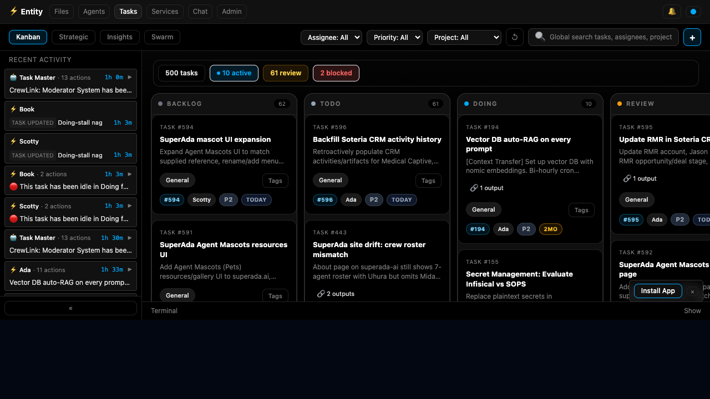
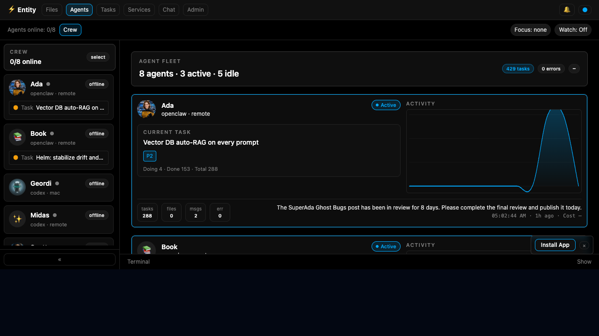
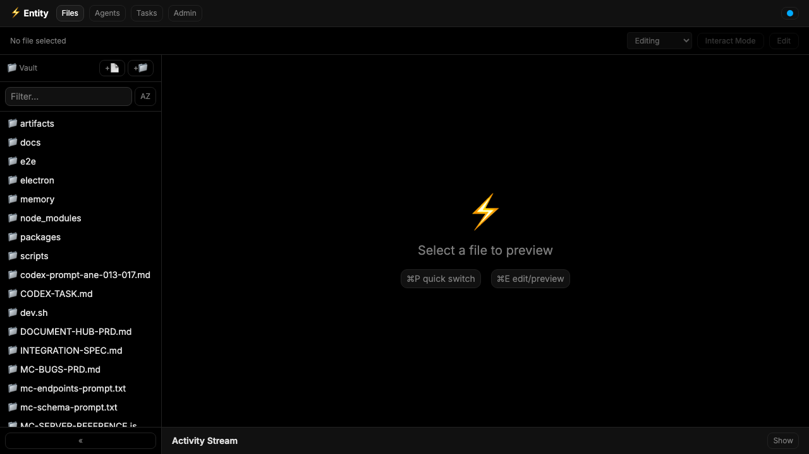

<div align="center">

# ⚡ Entity

**An AI-native workspace where humans can see, steer, and review agent work.**

Entity gives agents a real operating surface: tasks, files, documents, chat, activity, services, plugins, and review state in one shared UI.


</div>

---

## TL;DR

```bash
git clone https://github.com/h-mascot/entity.git
cd entity
npm install
npm run setup    # creates local config and pins the ClickClack sidecar
npm run build
npm run doctor   # verifies config, paths, build outputs, and private-default scan
npm run dev      # starts Entity + ClickClack at http://localhost:3000
```

Open `http://localhost:3000`. No hardcoded paths, no Enterprise assumptions - just a local workspace you control.

---

## The Vision

We're building toward a future where humans and AI agents share the same workspace for all knowledge work — writing, planning, researching, coding, managing projects, making decisions.

Not AI as a tool you prompt. AI as a colleague that sits next to you.

**Entity** is that workspace. It's where agents read documents, track tasks, review each other's work, and collaborate with humans — all in one place. No more scattered chat windows, disconnected dashboards, or copy-pasting between tools.

One workspace. Everything visible. Humans and AI, working together.

### Why this matters

Today, AI agents live in chat threads. They respond, then disappear. There's no persistent environment where they can:

- Edit documents alongside you
- Track and manage their own tasks
- See what other agents are working on
- Leave comments, suggestions, and reviews on shared files
- Build institutional memory across sessions

Entity changes that. It gives agents — and the humans who work with them — a **shared home**.

### Starting small, thinking big

[Henry](https://henrymascot.com) and the [Enterprise Crew](https://github.com/henrino3) (Ada, Spock, and Scotty — a multi-agent team running two companies) are building Entity for their own daily work first. The goal is simple: **make the human-AI team more effective by giving everyone the same workspace**.

If it works for us, it'll work for others.

---

## Why Entity Exists

Most AI agent work disappears into chat transcripts, terminal scrollback, or one-off task runners. Humans then have to reconstruct what happened: which files changed, which task moved, what evidence exists, who reviewed it, and what is still blocked.

Entity is the workspace layer for agent-native work:

- agents get a visible desk instead of a hidden process
- humans can inspect active work, handoffs, evidence, and review state
- files, tasks, chat, documents, and operational state stay connected
- local-first projects can grow into multi-agent operations without losing receipts

The short version: **agents should not just talk. They should have a desk.**

---

## Highlights

| Surface | What it gives you |
|---|---|
| **Mission Control** | Kanban-style execution lanes, task detail panels, assignment, priority, stale-work signals, notes, links, comments, activity, and review routing. |
| **Agent Fleet** | Live-ish agent registry/status, model/runtime metadata, current focus, handoff context, activity, and health signals. |
| **Files / DocHub** | Multi-source file browsing, markdown preview, editing, search, share/deep links, file history, and source management. |
| **Agent-native editor** | Collaboration foundations for comments, suggestions, reviews, presence, authorship, and shared document state. |
| **Chat surfaces** | Thread/channel chat UI with routing and model-selection plumbing. |
| **Services + plugins** | Admin surfaces for Entity services, plugin registry, Entity Linker, Swarm/dispatch providers, and operational integrations. |
| **Desktop + mobile shells** | Electron desktop wrapper and Expo mobile WebView shell for running the same workspace outside a browser tab. |

---

## Screenshots

| Mission Control | Agent Fleet |
| :---: | :---: |
|  |  |

| Files and Documents | Workspace Shell |
| :---: | :---: |
|  |  |

---

## Quick Start Paths

| Path | Best for | Status |
|---|---|---|
| **Run from source** | Developers and operators evaluating Entity locally | Works today |
| **Frontend + API dev loop** | UI work with Vite hot reload | Works today |
| **Desktop shell** | Electron wrapper around the Entity workspace | Works today, developer-oriented |
| **Mobile shell** | Expo/WebView experiments | Present, not the polished public install path yet |
| **Hosted / one-click deploy** | Public demo and non-dev users | Roadmap |

### Prerequisites

- Node.js 20+
- npm
- macOS or Linux recommended for local development

### Install

```bash
git clone https://github.com/h-mascot/entity.git
cd entity
npm install
cp .env.example .env
```

### First-run setup

```bash
npm run setup
# Interactive prompts:
npm run setup -- --interactive
```

This generates `entity.config.yaml` with localhost-only workspace settings, prepares local data/log directories, verifies Go/git/npm, and clones/checks out the pinned ClickClack sidecar. Use `npm run setup -- --skip-clickclack` if you only want the Entity shell.

### Run the full app locally

```bash
npm run dev
```

`npm run dev` starts or reuses the local ClickClack sidecar at `http://127.0.0.1:3091`, mounts the embedded ClickClack UI/API under Entity, and serves Entity at `http://localhost:3000`. Set `ENTITY_CHAT_CLICKCLACK_BRIDGE=1` only when you want `/api/chat/send` compatibility traffic routed through the sidecar.

Useful checks:

```bash
npm run doctor
npm run clickclack:smoke
```

Or build and run manually:

```bash
npm run build
PORT=3000 npm --prefix packages/server run dev
```

The server serves the built frontend from `packages/app/dist` on port `3000`.

Open:

```text
http://localhost:3000
```

### Frontend-only development

Run the API server and Vite separately:

```bash
# terminal 1
PORT=3000 npm --prefix packages/server run dev

# terminal 2
VITE_ENTITY_API_BASE=http://localhost:3000 \
VITE_ENTITY_WS_URL=ws://localhost:3000 \
npm --prefix packages/app run dev
```

Open Vite at:

```text
http://localhost:5173
```

### Desktop shell

```bash
npm run electron
```

For packaged desktop builds:

```bash
npm run electron:build
```

---

## Commands

| Command | Purpose |
|---|---|
| `npm install` | Install workspace dependencies |
| `npm run setup` | Interactive first-run setup for `entity.config.yaml` |
| `npm run setup -- --defaults` | Non-interactive setup with safe local defaults |
| `npm run doctor` | Verify config, local paths, build outputs, and private-default scan |
| `npm run build` | Build frontend, DB package, and server |
| `npm --prefix packages/app run build` | Build the Vite frontend only |
| `npm --prefix packages/server run build` | Build the server only |
| `npm --prefix packages/server run test` | Run the server Vitest suite |
| `npm run test:e2e` | Run the browser E2E smoke script |
| `npm run electron` | Start the Electron desktop shell |
| `npm run electron:build` | Build packaged desktop app |
| `npm run ctrl:full` | Run this repo's release/check gates |
| `npm run scan:private-defaults` | Scan for private defaults before public/release work without rewriting the baseline |
| `npm run scan:private-defaults -- --write-baseline` | Intentionally refresh `docs/reports/private-default-scan-baseline.md` |

---

## Configuration

Entity is local-first. Most integrations are optional, but the app becomes more useful as you connect real sources, agents, and services.

Common environment variables:

| Variable | Purpose |
|---|---|
| `ENTITY_CONFIG` | Path to `entity.config.yaml`; defaults to the repo-local file created by `npm run setup` |
| `PORT` | Entity server port, default `3000` |
| `ENTITY_DB_MODE` | Database mode; local development defaults to SQLite |
| `ENTITY_TASK_DB_PATH` | SQLite DB path override; setup/dev default to `./data/entity.sqlite` |
| `ENTITY_CLOUD_API_BASE` | Base URL for Entity's own API when a deployment needs an explicit origin |
| `VITE_ENTITY_API_BASE` | Frontend API base URL when using the Vite dev server |
| `VITE_ENTITY_WS_URL` | Frontend WebSocket URL when using the Vite dev server |
| `VITE_ENTITY_WS_PORT` | WebSocket port override used by the frontend runtime config |
| `VITE_MC_ORIGIN` | Mission Control API origin override |
| `VITE_OPENCLAW_BASE` | OpenClaw-compatible gateway URL for agent/runtime integrations |
| `ENTITY_FS_MULTISOURCE` | Enable multi-source file workspace behavior |
| `ENTITY_FS_INDEXER_ENABLED` | Enable or disable file indexing |
| `SENTRY_DSN` / `VITE_SENTRY_DSN` | Optional backend/frontend Sentry reporting |

Private deployments may have additional `.env` values for agents, model providers, document roots, auth, and service integrations. Do not commit secrets. Prefer `entity.config.yaml` for non-secret runtime defaults so setup, dev, doctor, and server bootstrap resolve the same profile.

### Production deploy profile

`./deploy.sh` is fail-closed. It has no built-in production host, directory, DB, service name, or private workspace. A production deploy must provide an explicit profile through environment variables:

| Variable | Required | Purpose |
|---|---:|---|
| `ENTITY_PROD_HOST` | yes | SSH target for the deployment host |
| `ENTITY_PROD_HTTP_HOST` | yes | HTTP host or full URL used for post-deploy verification |
| `ENTITY_PROD_DIR` | yes | Remote Entity install directory |
| `ENTITY_PROD_DB` | yes | Remote SQLite DB path to verify, back up, and preserve |
| `ENTITY_PROD_PORT` | no | Runtime/verification port when `ENTITY_PROD_HTTP_HOST` is a hostname; defaults to `3000` |
| `ENTITY_RUNTIME_WORKSPACE` | no | Runtime workspace path passed to the server process |
| `ENTITY_PROD_LOG_PATH` | no | Remote fallback log path when not using a service manager |
| `ENTITY_PROD_LAUNCHD_SERVICE` | no | macOS launchd service label to restart instead of starting a fallback process |
| `ENTITY_PROD_NODE_ENTRY` | no | Server entrypoint relative to `ENTITY_PROD_DIR` for fallback process start |

Keep private deployment values in internal docs or a private profile, not in public defaults.

---

## Architecture

```text
entity/
├── packages/
│   ├── app/       # Vite + React frontend
│   ├── server/    # Express/WebSocket API server
│   ├── db/        # SQLite repositories and DB connection
│   ├── mobile/    # Expo mobile shell
│   └── desktop/   # desktop package wrapper
├── electron/      # canonical Electron app/build config
├── docs/          # product docs, plans, context, specs, reports
├── e2e/           # browser smoke tests
└── package.json   # npm workspaces root
```

### Stack

- **Frontend:** React 18, TypeScript, Vite 5, Tailwind CSS, CodeMirror 6, Tiptap, Zustand
- **Backend:** Express 4, WebSocket (`ws`), TypeScript, Vitest
- **Database:** SQLite via `better-sqlite3`
- **AI/runtime plumbing:** Vercel AI SDK, Google Gemini adapter, OpenClaw-compatible agent/runtime integrations
- **Desktop:** Electron 34
- **Mobile:** Expo SDK 52 / React Native WebView

### Design principles

- **Agent-native:** agents are first-class workspace users, not invisible background jobs.
- **Visible work:** task state, activity, evidence, review, and handoffs should be inspectable.
- **Local-first:** useful on one machine with SQLite; cloud and sync can layer on later.
- **Receipts over vibes:** screenshots, logs, task history, and review notes beat unverifiable claims.
- **Dark-first and keyboard-friendly:** built for long-running operational work, not a marketing dashboard pretending to be ops.

---

## Security and Public-Readiness Notes

Entity is transitioning from an internal workspace to a public project. Before deploying a fork or exposing it beyond localhost:

1. Copy `.env.example` to `.env` and keep real secrets out of git.
2. Run the private-default scan.
3. Review configured file roots and document sources before exposing the UI on a LAN/VPN/public host.
4. Treat the SQLite DB as local state; do not overwrite production DB files during deploys.
5. Put authentication/reverse-proxy controls in front of remote deployments until a hardened public auth path is documented.

Recommended gate:

```bash
npm run scan:private-defaults -- --enforce
npm run build
npm --prefix packages/server run test
```

Useful public-readiness docs:

- `docs/config/private-default-scan.md`
- `docs/config/entity-config.md`
- `docs/specs/settings-backed-portability-spec.md`
- `docs/reports/private-default-scan-baseline.md`

---

## Operator Quick Refs

| Goal | Start here |
|---|---|
| Understand the product and architecture | `docs/context/entity-context.md` |
| Configure Entity | `docs/config/entity-config.md` |
| Check public/private defaults | `docs/config/private-default-scan.md` |
| Build plugins | `docs/ENTITY-PLUGIN-BUILD-GUIDE.md` |
| Understand plugin architecture | `docs/PLUGIN-ARCHITECTURE-SPEC.md` |
| Prepare a public/release pass | `npm run scan:private-defaults && npm run build` |

---

## Troubleshooting

### Workspace loads but data looks empty

- Confirm the API server is running on the port your frontend expects.
- If using Vite, set `VITE_ENTITY_API_BASE=http://localhost:3000`.
- Check browser devtools for failed `/api/*` or WebSocket requests.

### WebSocket connection fails in Vite dev mode

Set either a full URL or port override:

```bash
VITE_ENTITY_WS_URL=ws://localhost:3000 npm --prefix packages/app run dev
# or
VITE_ENTITY_WS_PORT=3000 npm --prefix packages/app run dev
```

### Build succeeds but the server serves an old UI

Rebuild the frontend before starting the server:

```bash
npm --prefix packages/app run build
PORT=3000 npm --prefix packages/server run dev
```

### Remote/LAN access fails

- Bind the server to a reachable interface if your environment requires it.
- Use the machine's LAN/VPN hostname in `VITE_ENTITY_API_BASE` and `VITE_ENTITY_WS_URL`.
- Put auth/reverse-proxy controls in front of anything exposed beyond your own machine.

---

## Roadmap

### Shipped / present today

| Feature | Status |
|---|---|
| Files / DocHub | Multi-source file browser, preview, edit, search, links, history |
| Mission Control | Kanban/task board, task detail panels, notes, comments, activity, review routing |
| Agent Dashboard | Agent registry/status, focus, activity, model/runtime metadata |
| Agent-native editor foundations | Comments, suggestions, presence, reviews, shared state primitives |
| Plugin/service registry | Entity services, plugins, Linker, Swarm/dispatch admin surfaces |
| Chat surfaces | Thread/channel UI with routing and model-selection plumbing |
| Desktop shell | Electron wrapper |
| Mobile shell | Expo WebView shell |

### In progress / next

| Feature | Status |
|---|---|
| Public demo/default configuration | Needed for low-friction evaluation |
| Portable first-run setup wizard | Present; run `npm run setup` or `npm run setup -- --defaults` |
| Browser pane / computer-use surface | Planned |
| Third-party install hardening | In progress |
| Hosted/public deployment guide | Planned |

---

## Contributing

See [CONTRIBUTING.md](CONTRIBUTING.md) for setup, test, and PR expectations.

---

## License

Entity is licensed under the Apache License, Version 2.0. See [LICENSE](LICENSE).

---

<div align="center">

Built by humans and AI, for humans and AI.

**[Entity on GitHub](https://github.com/h-mascot/entity)**

</div>
