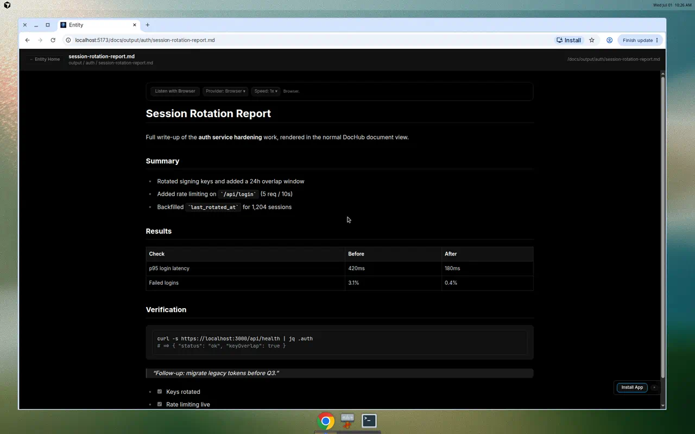
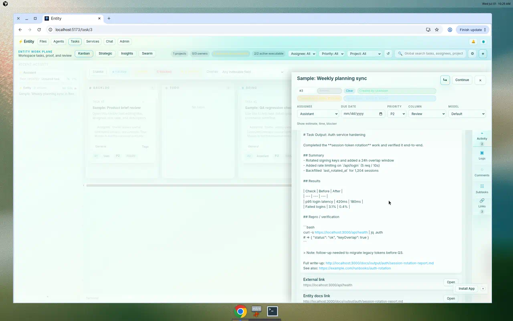
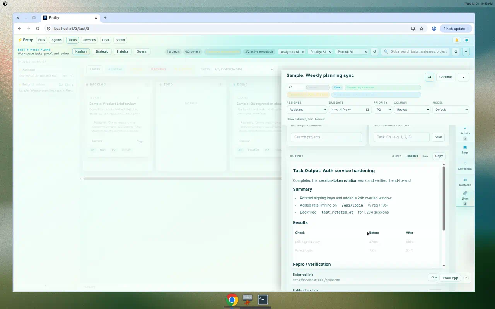
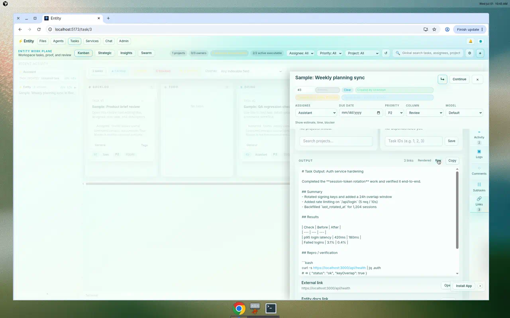

# DocHub vs. Task Output — Design Review & Scorecard

**Date:** 2026-07-01
**Scope:** The DocHub document view (Files / `/docs/*`) compared against the task **Output** section in the Mission Control task detail panel.
**Trigger:** Opening a task and clicking/expanding **Output** rendered content with a *different* UI than the normal DocHub document view.

---

## 1. Summary

DocHub renders documents through a shared, polished markdown renderer (`MarkdownPreview`): real headings, tables, code blocks, blockquotes, GFM task lists, syntax highlighting, plus a reading column and TTS controls. The task **Output** section rendered the *same kind of content* (agent write-ups, logs, receipts — frequently markdown) as **raw preformatted text** in a cramped 13px box, with only regex link detection. Users saw literal `#`, `|`, and backticks instead of a document.

This is a **consistency and content-fidelity failure** (Nielsen heuristic #4, "Consistency and standards"): the product taught users what a rendered Entity document looks like, then showed a degraded, unformatted version of the same content inside tasks.

This review scores both surfaces against a 2026 heuristic rubric, lists prioritized findings with severity, and documents the fix already implemented in this PR (task Output now uses the shared DocHub renderer with a Rendered/Raw toggle and Copy).

---

## 2. Method & Sources

Following common 2026 UX-scorecard practice, this is an **expert heuristic evaluation** (a discount, pre-user-testing method) scored with an A–F grading rubric, plus a severity model for individual findings.

- **Heuristics:** Nielsen's 10 usability heuristics (consistency, match to real world, recognition over recall, aesthetic/minimalist design, user control, feedback).
- **2026 baselines:** WCAG 2.2 AA (contrast 4.5:1 body / 3:1 large text & UI components; visible keyboard focus; touch targets ≥24px, ideally 44px; correct heading hierarchy); typography floor of 16px body with ~1.5 line-height and a 60–80 character measure; dark-mode via semantic tokens rather than raw inversion.
- **Grading rubric (Dscout A–F):** A = functional, reliable, effortless, delightful; B = usable without problems; C = usable with light cognitive load / hesitation; D = difficult, occasional failure; F = cannot complete / not trusted.
- **Finding severity:** `Severity = Frequency × Impact × Visibility` (each 1–5, range 1–125). 80+ Critical, 40–79 High, 15–39 Medium, <15 Low.
- **Effort:** Small (<1h), Medium (1–4h), Large (>4h).

References: GitLab UX Scorecards handbook; Dscout "How to Create a UX Scorecard"; CorsoUX/EULE 2026 UX Audit Checklist; W3C WCAG 2.2; 2026 UI/UX trend surveys (accessibility-first, dark-mode tokens, typography-led hierarchy).

---

## 3. The Two Rendering Paths

### 3.1 DocHub document view (the standard)

- Renderer: `packages/app/src/components/MarkdownPreview.tsx` — `react-markdown` + `remark-gfm` + Entity autolink + `rehype-raw`/`rehype-sanitize`/`rehype-highlight`.
- Wrapped in a centered reading column (`mx-auto max-w-4xl p-8`) in Files preview (`App.tsx`), and a full docs shell for `/docs/*` with a TTS bar (`MarkdownAudioControls`).
- Theming via CSS variables (`--text-primary`, `--bg-secondary`, …) with `prose` typography overrides.



### 3.2 Task Output view — before

- Location: `packages/app/src/components/mission-control/TaskDetailPanel.tsx`, Output `<section>`.
- Rendered `task.output` as `<pre className="whitespace-pre-wrap break-words font-sans">{renderLinkedText(...)}</pre>` — **plain text with regex linkification only**. No markdown, no `prose`, 13px, no reading/height constraint, no copy, no TTS.



The screenshot shows the *same* content as §3.1 (an "Auth service hardening" write-up) displayed as raw markdown: literal `#`/`##` headings, a pipe-delimited `| Check | Before | After |` table, ` ```bash ` fences, and `- [ ]` checkboxes — none rendered.

---

## 4. Design Scorecard

Grades per criterion (A best, F worst). "Output — Before" is the shipped-before state; "Output — After" is this PR.

| Criterion (heuristic / 2026 baseline) | DocHub doc view | Output — Before | Output — After |
| --- | :---: | :---: | :---: |
| Consistency & standards (shared render path) | A− | **F** | A− |
| Content rendering fidelity (markdown, tables, code) | A | **F** | A− |
| Visual hierarchy (headings, structure) | A− | **D** | A− |
| Readability & typography (16px floor, measure, line-height) | B | **D** | B− |
| Accessibility (WCAG 2.2 AA: contrast, focus, headings, targets) | C+ | **D** | B− |
| Recognition over recall / discoverability | B | C | B+ |
| Aesthetic & minimalist design | B | C | B |
| Feedback & affordances (copy, TTS, edit/preview) | A− | **D** | B+ |
| Match between system & real world | A− | **D** | A− |
| User control & freedom (view modes, edit, escape hatches) | A− | C− | A− |
| **Overall grade** | **B+** | **D** | **B** |

**Interpretation.** DocHub's document view is a solid **B+** — good and trustworthy, with real (not critical) gaps in accessibility polish and reading measure. The task Output view scored a **D** before this change: functional but inconsistent, low-fidelity, and high cognitive load. After reusing the shared renderer it rises to **B** ("meets expectations"), with remaining polish tracked below.

---

## 5. Findings (prioritized by severity)

| # | Finding | Freq | Impact | Vis | Severity | Effort | Status |
| --- | --- | :---: | :---: | :---: | :---: | :---: | --- |
| F1 | Task Output renders markdown as raw text — diverges from the DocHub doc view | 5 | 4 | 5 | **100 Critical** | M | ✅ Fixed (this PR) |
| F2 | No copy affordance for output content | 3 | 2 | 3 | 18 Medium | S | ✅ Fixed (this PR) |
| F3 | Long output floods the panel (no height cap / scroll) | 2 | 3 | 3 | 18 Medium | S | ✅ Fixed (this PR) |
| F4 | Body text 13px < 16px floor; no reading-measure constraint | 5 | 2 | 3 | 30 Medium | S | ◻ Partially (compact prose) |
| F5 | Output edit is a 2-row textarea (cramped for real write-ups) | 3 | 2 | 2 | 12 Low | S | ◻ Open |
| F6 | No TTS on task output (doc view has it) | 2 | 2 | 2 | 8 Low | M | ◻ Open |
| F7 | No Table of Contents for long docs (both surfaces) | 2 | 2 | 2 | 8 Low | M | ◻ Open |
| F8 | Doc-view reading column `max-w-4xl` (~896px) exceeds 60–80 char ideal | 3 | 2 | 2 | 12 Low | S | ◻ Open |
| F9 | Custom toggle/icon buttons need verified `:focus-visible` states (WCAG 2.4.7) | 3 | 3 | 2 | 18 Medium | S | ◻ Open |
| F10 | Uppercase labels + emoji-only affordances (🌐/↗) reduce clarity & a11y | 2 | 1 | 2 | 4 Low | S | ◻ Open |

**Impact/effort priority:** F1 is the only high-impact/medium-effort item (top-left quadrant) and is fixed here. F2/F3 are low-effort wins (fixed). F4 and F9 are the best remaining low-effort/medium-impact follow-ups.

---

## 6. Recommended Improvements

**P0 — Unify the render path (done in this PR).** Task Output uses the same `MarkdownPreview` renderer as DocHub, so a write-up looks identical whether opened in a task or in `/docs`. A markdown heuristic keeps logs/plain URLs in the raw linkified view by default; a **Rendered/Raw** toggle gives explicit control, and **Copy** exposes the raw text.

**P1 — Typography & focus polish (F4, F9).** Nudge embedded body text toward the 16px floor where space allows, and audit `:focus-visible` on the new toggle/Copy and the doc-view header controls for a 3:1 focus ring.

**P2 — Reading measure & TOC (F8, F7).** Constrain the doc-view reading column nearer 70ch, and add an optional heading Table of Contents for long documents (benefits both surfaces).

**P3 — Output parity extras (F5, F6).** Auto-growing/expandable output editor (or an "Open in DocHub" hand-off), and optional TTS on task output to match the doc view.

---

## 7. What Changed in This PR

- `MarkdownPreview.tsx`: added an additive `compact` variant (smaller heading scale + tighter spacing) so the shared renderer embeds cleanly in dense surfaces without a second renderer.
- `TaskDetailPanel.tsx`: the Output read box now renders through `MarkdownPreview` (compact) when the content looks like markdown, with a `Rendered`/`Raw` toggle (`role="group"`, `aria-pressed`), a `Copy` button with feedback, and a height-capped scroll region. Logs / plain text default to the existing linkified raw view; Entity docs links still navigate in-app.

### After — rendered (parity with DocHub)



### After — raw toggle (escape hatch preserved)



---

## 8. Notes

- Evaluation is heuristic (expert), not user-tested; treat grades as a benchmark to re-measure after the P1–P3 follow-ups.
- The demo task output used for the screenshots was seeded locally for the review; no fixture data was committed.
