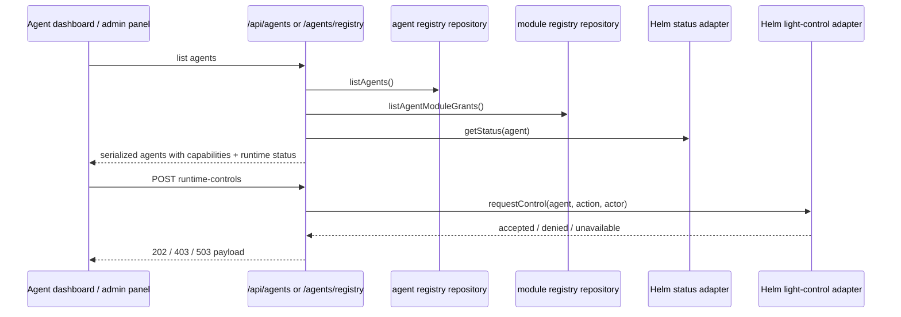

# Agents and activity

Entity treats agents as first-class workspace actors. The product surfaces them in dashboards and sidebars, and the server keeps a registry plus health/runtime metadata available for inspection and control.

The main source seams are:

- `packages/app/src/components/AgentDashboardV2.tsx`, `packages/app/src/components/AgentsSidebarTab.tsx`, and `packages/app/src/components/ActivityStream.tsx` for the UI.
- `packages/server/src/routes/agent-registry.ts` and `packages/server/src/routes/agents.ts` for registry and control APIs.
- `packages/server/src/routes/activity-log.ts` and `packages/server/src/routes/operational-status.ts` for activity and status data.
- `packages/db/src/index.ts` for registry and module-grant data models.

## What users can see

- Registered agents and their runtime metadata.
- Health and readiness summaries.
- Activity streams that show recent agent work.
- Agent capability cards derived from registry records plus module grants.
- Runtime control actions when the backend exposes a control adapter.

## Agent registry

`packages/server/src/routes/agent-registry.ts` exposes create, update, delete, list, and runtime-control endpoints. The route validates slug and status values, merges registry records with module-grant information, and enriches each agent with a Helm-derived runtime status summary when an adapter is available.

This is more than a simple directory of names. The registry record captures:

- adapter type;
- runtime type and runtime binding id;
- provider type;
- status;
- instructions path;
- metadata JSON;
- helm-managed state.

That means the registry is both a UI surface and a control-plane record.

## Runtime health and control

The registry route can return runtime status summaries and can send control requests through a Helm light-control adapter. That is why the source contains both status adapters and control adapters; the UI can show current health and also request controlled changes when supported.

## Activity and operational status

The activity feed is the human-readable record of what agents and tasks have been doing. It is distinct from chat and distinct from the task board, though the product connects all three.

The server-side activity endpoints and operational-status routes feed the UI with recent activity and health-style signals so the workspace can show whether the system is lively, degraded, or stale.

## Change notes for future agents

When changing agents or activity, inspect both registry and status code. A UI change that only reads the registry can still miss health or runtime control regressions.

Good checkpoints are:

1. `packages/server/src/routes/agent-registry.ts` for contract and validation.
2. `packages/server/src/routes/agents.ts` and `packages/server/src/routes/activity-log.ts` for the activity feed.
3. `packages/app/src/components/AgentDashboardV2.tsx` and `packages/app/src/components/AgentsSidebarTab.tsx` for what the user sees.
