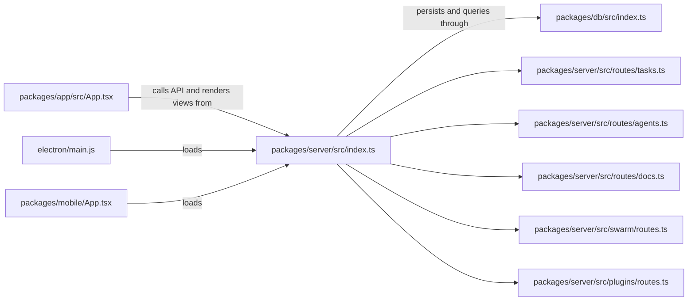

# Architecture overview

Entity is organized as a server-backed workspace rather than a static frontend. The browser app in `packages/app` renders the product surface, the Express server in `packages/server` owns route handling and runtime wiring, and `packages/db` provides the shared persistence layer used by both UI and backend logic.

## Main runtime pieces

| Package / entrypoint | Role |
|---|---|
| `packages/server/src/index.ts` | Main Express bootstrap. It loads configuration, applies security hardening, mounts API routes, starts WebSocket handling, and wires task, agent, docs, plugin, runtime, and Swarm routers. |
| `packages/app/src/App.tsx` | Main web workspace shell. It lazy-loads product views for files, mission control, agents, docs, plugins, admin, chat, and mobile variants. |
| `packages/db/src/index.ts` | Shared data and repository layer. It defines task columns, policy and worktype models, document collaboration records, file source repositories, and task sync helpers. |
| `electron/main.js` | Electron wrapper that opens the server-backed web app and can spawn a local server when needed. |
| `packages/mobile/App.tsx` | Expo mobile shell that embeds the same server-backed workspace in a WebView and lets the user point at a LAN-hosted server. |

## Runtime boundaries

The server owns the security boundary and the product API. In `packages/server/src/index.ts`, it applies security hardening, sets API no-store headers, enables API authentication middleware, and then mounts the feature routers. The browser app consumes those routes over HTTP and WebSocket.

The desktop and mobile shells do not reimplement the product. They wrap the same web workspace:

- `electron/main.js` probes `ENTITY_URL`, starts `npm run dev` locally when the server is missing, and then loads the app in a `BrowserWindow`.
- `packages/mobile/App.tsx` probes a server URL, falls back to a connect screen when the server is unreachable, and then loads the same workspace in a `WebView`.

## Relationship map

The diagram shows the intended layering: the UI is thin, the server concentrates behavior, and the shared database package keeps task and collaboration types consistent across route handlers and repositories.

## Configuration and environment seams

`entity.config.example.yaml` and the bootstrap logic in `packages/server/src/index.ts` show that the workspace is meant to be configurable at runtime. Important seams include:

- server bind host and port;
- workspace root and file-source roots;
- task columns and default assignee behavior;
- plugin settings and provider configuration;
- voice and deploy defaults;
- API authentication and non-loopback bind protections.

## Where to start when changing architecture

- Start in `packages/server/src/index.ts` to understand route registration and runtime wiring.
- Inspect the affected server router file before modifying a feature implementation.
- Use `packages/db/src/index.ts` to confirm the persistence shape before adding new UI states.
- Keep shell wrappers thin; changes to Electron or Expo should preserve the same server-backed contract.
