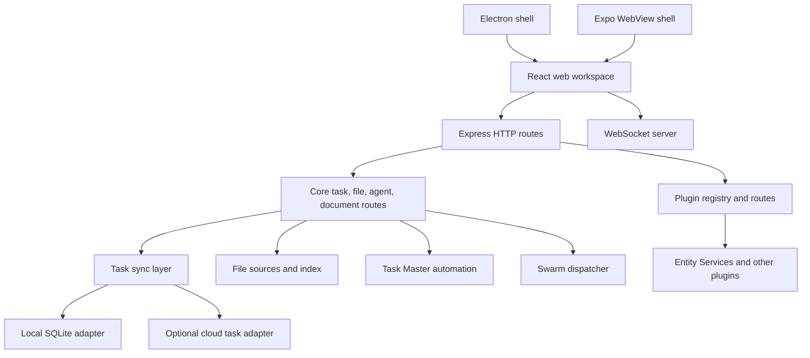
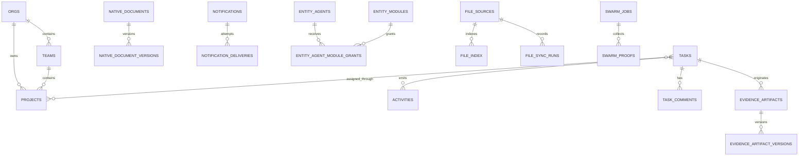

# Runtime and data architecture

Entity is an npm-workspace monorepo whose default deployment is one server process plus an in-process SQLite library. The built React application is served by Express; WebSocket transport carries live activity and collaboration events. Optional external systems—cloud task storage, agent gateways, ClickClack, health-checked services, and Swarm providers—attach at defined seams.

*The shells host the same web client, while one server composes local data and optional external adapters.*

## Package ownership

| Path | Responsibility |
|---|---|
| `packages/app` | React 18, Vite, Tailwind, editor components, state-driven tabs, responsive mobile views |
| `packages/server` | Express, WebSocket, security middleware, routes, file/editor subsystems, Task Master, plugins, Swarm |
| `packages/db` | `better-sqlite3` connection and repositories for tasks, scopes, activity, files, documents, chat, tokens, and collaboration |
| `electron` | Canonical desktop launcher and packaging |
| `packages/mobile` | Expo WebView shell and connection setup |
| `packages/desktop` | Legacy wrapper that delegates to `electron` |

`packages/server/src/index.ts` is the runtime composition root. It loads environment/config, applies security headers and global auth, creates HTTP/WebSocket servers, mounts routes and plugins, initializes repositories, and serves frontend assets.

## API families

Major canonical route families include:

- `/api/tasks` and task subroutes for board mutations, projects, history, comments, review, gates, dependencies, and receipts;
- `/api/fs/*` and `/api/sources/*` for source management, trees, file I/O, indexing, and search;
- `/api/documents/*` for scoped agent-native document collaboration;
- `/api/agents/*` and `/api/agent/*` for registry/runtime surfaces and Task Master;
- `/api/plugins/*`, plugin-declared bases, `/api/entity-services/*`, and `/api/swarm/*`;
- `/api/search/*`, `/api/docs/*`, `/api/chat/*`, `/api/notifications/*`, and runtime/config routes.

Tasks, activities, agent automation, runtime, projects, and other areas also expose legacy unprefixed mirrors. Global bearer middleware explicitly protects known mirrors when authentication is enabled. New code should prefer canonical `/api/*` paths and verify route-order behavior in `packages/server/src/index.ts`.

The frontend does not use a conventional route library. `packages/app/src/App.tsx` synchronizes major tabs and routes such as `/docs/:path`, `/task/:id`, `/onboarding`, `/onboard/agent/:token`, and `?file=&source=` with browser history. Most nested panels remain local React or local-storage state.

## Task storage abstraction

The [Mission Control](../features/mission-control.md) API calls a `TaskSyncLayer` defined in `packages/db/src/task-sync.ts`. Its `TaskAdapter` contract covers listing, creating, updating, claiming, moving, and deleting tasks. It chooses:

- the local SQLite adapter by explicit `LOCAL` mode or desktop/mobile preference; or
- a cloud HTTP adapter when configured and selected.

If cloud mode is requested without an available cloud adapter, resolution falls back to local. This abstraction applies to task operations; it does not make all Entity repositories cloud-backed.

## Core data model

*The SQLite model combines workspace scope, accountable tasks, documents/evidence, agents/modules, indexed files, notifications, and provider execution records.*

Important distinctions:

- `native_documents` are editable and versioned; `evidence_artifacts` carry provenance and may be immutable; `external_document_refs` model external read/index/link/preview capability and default write/export/sync/create/update to false.
- Tasks carry scope, creator/initiator/owner/executor fields, assignment state, worktype, risk, trust, policy inputs, external side effects, review state, and human-gate state alongside traditional board fields.
- Task comments and document comment threads are separate models.
- Some relationships are metadata or JSON references rather than SQL foreign keys. Do not assume database-enforced integrity for every conceptual link.

`getEntityDatabase()` in `packages/db/src/entity-db.ts` caches the SQLite connection and enables WAL, `synchronous=NORMAL`, foreign keys, and a five-second busy timeout. Keep `packages/db/src` TypeScript-only: stale compiled JavaScript there can shadow source under `ts-node`.

## Cross-domain flows

[Files and documents](../features/files-and-documents.md) use file-source and collaboration repositories, then link outputs back to tasks. [Agents](../features/agents-and-collaboration.md) consume registry, activity, metrics, and task data. [Execution and proof](../platform/execution-and-proof.md) references tasks but maintains separate Swarm tables and completion evidence. [Configuration](../platform/configuration-and-plugins.md) seeds agents, file sources, and plugin defaults into runtime persistence.

## Change guidance

- Route work: start at `packages/server/src/index.ts`, then the owning route module; check canonical and legacy mounts, auth order, and focused route tests.
- Schema/repository work: inspect `packages/db/src/index.ts` plus specialized schema owners such as `document-collab.ts`, `file-index.ts`, and `agent-tokens.ts`. Migration-by-introspection means duplicate schema ownership can drift.
- UI navigation work: inspect `packages/app/src/App.tsx`, responsive `views/MobileView.tsx`, URL/history behavior, and state restoration tests.
- Shell work: keep Electron sandboxing (`nodeIntegration: false`, `contextIsolation: true`, `sandbox: true`) and mobile connectivity behavior intact.
