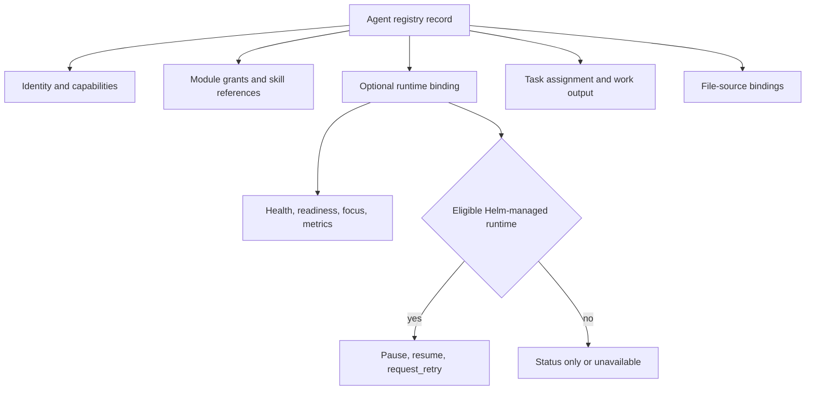
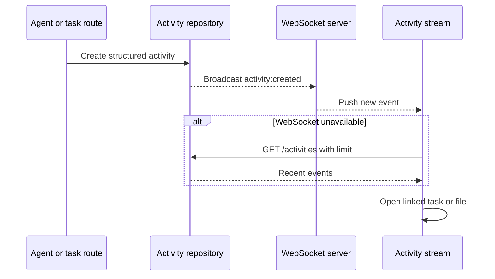

# Agents, activity, and collaboration

Entity treats an agent as a persistent registry/runtime identity with work context—not merely a model in a chat picker. The Agents workspace combines registry records, runtime/model metadata, current focus, assigned tasks, output, health, queue state, activity, and metrics.

## Agent workspace

`packages/app/src/components/AgentDashboardV2.tsx` is the main dashboard. It polls agent endpoints approximately every 30 seconds and merges server data with task/activity state supplied by the app shell. `AgentsSidebarTab.tsx` provides compact status/fallback display; `AgentManagementSurface.tsx` exposes operational controls.

Key API areas include:

- `/api/agents` and `/api/agents/registry` for identity and registration;
- `/api/agents/status`, `/api/agents/focus`, and `/api/agents/metrics` for live-ish work and health context;
- per-agent runtime controls for eligible bindings;
- module grants and skill references persisted with agent/module registry records.

Agent data feeds [Mission Control](mission-control.md) assignment and accountability, while source bindings contribute to [Files](files-and-documents.md) filtering and attribution.

## Registry and runtime relationship

*Registry identity organizes work; runtime binding determines whether health and reversible controls are available.*

Entity separates its work plane from deep runtime administration. The UI allows only `pause`, `resume`, and `request_retry`, and only when a runtime is bound, Helm-managed, and not unavailable. Registry failure is a partial degradation: fallback identity can remain visible while management details and controls disappear.

## Activity transport

The activity stream merges agent and task events and can navigate to referenced files or tasks. `packages/app/src/hooks/useActivityStream.ts` consumes `activity:created` WebSocket messages; when the socket is disconnected it polls `/activities?limit=...`. Event kinds cover file/tool/message/command/research/thinking activity plus task lifecycle and comments.

*Activity is pushed when possible and polled as a fallback, with object links connecting work surfaces.*

The [canonical receipt](../platform/execution-and-proof.md#canonical-task-completion-receipts) also emits an activity event, making completion evidence visible in the same event plane.

## Invitations and onboarding

The implemented invite workflow is specifically **first-agent onboarding**, not organization membership management. `OnboardingFlow.tsx` creates an agent session and exposes a tokenized `/onboard/agent/:token` route. Path-token-authenticated endpoints provide manifest, progress, skill, and bundle resources for that session.

Do not describe this as a general user/team invitation system: no such management surface was found in the connected frontend. The onboarding path bypasses global bearer auth because it authenticates with its own path token, as declared in `middleware/api-auth.ts`.

## Collaboration boundaries

- Registry identity and activity attribution do not guarantee that an external runtime is online.
- A task handoff activity does not guarantee runtime dispatch; see [Mission Control](mission-control.md#comments-and-handoffs).
- Document presence, cursors, authorship, comments, and suggestions belong to the Documents subsystem, documented in [Files and documents](files-and-documents.md).
- Chat model selection, task execution model, agent-resolved model, and TTS model are distinct settings; see [Configuration and plugins](../platform/configuration-and-plugins.md#model-settings).

## Change and test guidance

Start with `AgentDashboardV2.tsx`, `AgentManagementSurface.tsx`, `useActivityStream.ts`, server `routes/agents.ts`, `routes/agent-registry.ts`, `agent-metrics.ts`, and the registry repositories in `packages/db/src/index.ts`. Verify:

- registry success and fallback states;
- health/metrics polling and stale/unavailable presentation;
- runtime-control eligibility and error handling;
- WebSocket delivery plus polling fallback;
- task/file navigation from activity;
- tokenized onboarding progress without exposing tokens in logs or docs.

Focused server tests cover registry, metrics, activity events, notifications, and security, but browser-checking responsive agent/activity empty and degraded states remains important.
