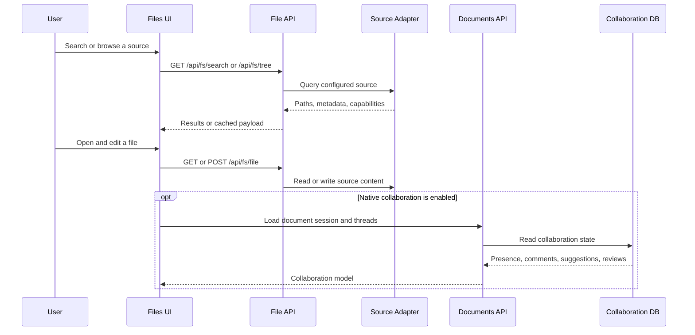

# Files and document collaboration

Files is the user-facing entry to Doc Hub. It combines configured sources, a searchable home, open-file tabs, source-backed editing, and—when identity and credentials allow—agent-native collaboration. It also receives document output links from [Mission Control](mission-control.md).

## User workflow

1. Open **Files** to search all enabled sources or filter by source, origin, file type, or agent, then sort results.
2. Open a result into Doc Hub. Open files are represented as tabs; users can return home, switch tabs, close tabs, and use split editing where supported.
3. Read or edit source content through `/api/fs/file`; source capabilities and document state determine what controls appear.
4. For a source-backed native document with Documents credentials, enter comments, suggestions, review findings, authorship, presence, and follow/watch workflows.
5. Open a task output. Entity prefers a matching enabled source in Doc Hub and falls back to `/docs/:path`, preserving return-to-task context.

Recent git changes refined this shipped surface by deduplicating the source selector/result metadata, adding sorting, showing date and time, and hiding editor controls on the Doc Hub home.

## Runtime flow

*Basic source I/O and native collaboration are connected but independently gated paths.*

## Implementation seams

### Frontend

- `packages/app/src/views/FilesView.tsx` chooses the unified dashboard or basic file state, then hosts `DocumentEditorView` inside `DocHubWorkspaceChrome`.
- `components/UnifiedFileDashboard.tsx` owns multi-source results, filters, sorting, restriction behavior, and result opening.
- `hooks/useFileSources.ts` calls source, tree, file, folder, and search endpoints and applies cached-read fallback.
- `lib/documents-client.ts` defines the collaboration API model: sessions, authorship, presence, comments/replies, suggestions, review runs/findings, edits, and cursor updates.
- `views/DocsRouteView.tsx` is a standalone reading/TTS route, not the full editing workspace.

### Server and data

- `packages/server/src/fs/` implements source registration, adapters, file security, trees, index/search, I/O, and source routes.
- `packages/db/src/file-sources.ts` and `file-index.ts` persist source definitions, indexed records, and sync runs.
- `packages/server/src/editor/` supplies collaboration routes, services, WebSocket behavior, and document-token authentication.
- `packages/db/src/document-collab.ts` persists sessions, authorship, presence, comment threads/replies, suggestions, and review data.
- `packages/server/src/routes/agent-api.ts` exposes scoped `/api/documents/*` operations; these self-authenticate with document token/scopes when the native editor is enabled.

The broader [runtime and data architecture](../architecture/runtime-and-data.md) distinguishes native documents, evidence artifacts, and external references.

## Flags, permissions, and degraded states

| Condition | Behavior |
|---|---|
| `VITE_ENTITY_FS_MULTISOURCE` false | The Files home omits the unified dashboard and asks the user to select a file from the sidebar |
| `ENTITY_FS_MULTISOURCE` false | Server multi-source behavior is disabled independently; align frontend and server flags |
| `ENTITY_FS_INDEXER_ENABLED` false | Index refresh behavior is disabled; direct source browsing may still exist |
| `VITE_ENTITY_AGENT_NATIVE_EDITOR` or `ENTITY_AGENT_NATIVE_EDITOR` false | Native collaboration is unavailable; basic source-backed file reading/editing is a separate path |
| Missing document ID, source ID, or Documents credential | Collaboration controls degrade even if ordinary file editing works |
| Network/source failure with cache | Cached source tree or file content may be shown with cache metadata/age |
| Restricted search result | Title/path snippets and preview/open actions are suppressed rather than leaking content |
| `http-markdown` source without a manifest | Exact-path reads still work, but list/search stay disabled and the source is reported as exact-read-only |
| `http-markdown` source with a valid same-origin manifest | Source tree, sync, and search can use manifest-listed markdown files while writes remain disabled |
| Legacy workspace path inside nested read-only local source | Workspace writes, creates, deletes, and moves are rejected; reads remain available |
| External Google reference lacks auth/scope or is deleted/restricted | Preview and link-out are reduced or hidden; external documents remain intentionally read-only |
| Read-only source in the convert dialog | Document conversion is blocked and the UI explains that the source is read-only |
| Binary source or unsupported conversion target | The backend rejects the request rather than creating a derivative document |
| Writable local source opened in the convert dialog | The UI can preview or create a new derivative document with preserved provenance |

Admin stores/configures Documents API access, but credentials are scoped bearer/service credentials and must not be embedded in documentation. The [security page](../operations/security-and-release.md) explains why object-permission enforcement is route-specific.

Config-managed file sources are a stricter case: the server treats `entity.config.yaml` ownership as sticky, so those sources cannot be deleted through the API, and their adapter type cannot be swapped to a different source kind such as `http-markdown`. When a trusted config-managed source is stored as another adapter type, the storage layer preserves the `entity.config.yaml` ownership marker so later updates keep the same source provenance. Legacy workspace write, create, delete, and move routes now also reject paths that fall inside nested read-only local sources, while reads from those sources remain available. Document conversion is constrained separately to enabled local sources with write capability, so a file can be browsed or read even when it is not eligible for conversion.

## Task and document relationships

A task output can target Doc Hub or the standalone document route; the route resolver is tested in `packages/app/src/lib/taskOutputDocTarget.test.ts`. Document comments are range-anchored collaboration objects, while task comments belong to [Mission Control](mission-control.md). Document review runs produce findings that may be applied or ignored; task review gates govern task completion. Keep these models distinct in UI and API changes.

The agent registry can bind agents to file sources, so [agent identity](agents-and-collaboration.md) is also used to filter and attribute file work.

## Change and test guidance

Start with the owning surface rather than `App.tsx` unless navigation or shared state is involved. Relevant focused tests include:

- `packages/app/src/lib/fileSearchSort.test.ts`
- `packages/app/src/lib/openFileTabs.test.ts`
- `packages/app/src/lib/taskOutputDocTarget.test.ts`
- `packages/app/src/lib/__tests__/fileRestoreState.test.ts`
- `packages/server/src/document-objects.test.ts`
- tests under `packages/server/src/fs/` and `packages/server/src/editor/`

Build the app and run server Vitest. Browser-check search, source switching, open/close/restore, save behavior, task return navigation, restricted results, and the responsive layout; utility tests do not cover the full cross-package workflow.
ity tests do not cover the full cross-package workflow.
