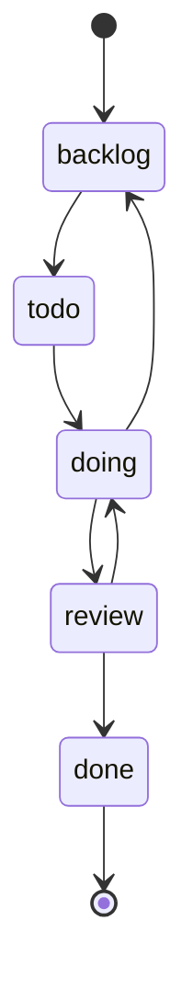

# Mission Control and tasks

Mission Control is Entity's task execution surface. It presents a board-oriented workflow for moving work across columns, inspecting task detail, review state, comments, activity, and handoff metadata. The server backs that surface with task routes, review logic, claims, receipts, activity events, and stricter task-create scope validation.

## What users can do

- create, edit, and move tasks across the workspace lifecycle columns, with create defaults that can preselect the canonical Engineering project when the work domain is engineering;
- filter and page task lists;
- inspect activity history and task metadata;
- claim policy-drivable work through Task Master behavior;
- complete tasks with canonical receipts and proof artifacts;
- route work through review gates when policy requires it;
- inspect duplicates and stale-work signals.

## Main implementation seams

- `packages/app/src/App.tsx` loads `TaskBoard`, `MCStrategicView`, `MCCreateTaskModal`, and the task detail panels.
- `packages/server/src/routes/tasks.ts` exposes the task list and task mutation endpoints.
- `packages/server/src/task-master-claims.ts` handles Task Master claim transitions and emits claim activity.
- `packages/server/src/receipt-writer.ts` generates canonical task receipts and records failure recovery state.
- `packages/server/src/activity-events.ts` records structured activity events used by the task timeline and notifications.
- `packages/server/src/task-accountability.ts`, `packages/server/src/task-output-links.ts`, and `packages/server/src/task-dedupe.ts` support accountability, output linking, and duplicate detection.
- `packages/db/src/index.ts` defines the task columns, review policy shapes, and related records.

## Task lifecycle

The task model is not just a to-do list. The code shows a lifecycle with explicit columns, active work, review states, receipts, and policy gating. `entity.config.example.yaml` seeds the default columns as `todo`, `doing`, `review`, and `done`, while `packages/db/src/index.ts` also recognizes `backlog` as a task column in the shared model.

The server's task routes support list, stale-task inspection, duplicate search, project assignment, accountability updates, task-create scope validation, and task state transitions. The route layer also enforces limits such as explicit pagination, normalized `work_domain` filtering, and bounded activity loading.

Caption: the canonical task columns visible in the shared model and config, with review and done as explicit terminal stages in the workspace flow.

## Task Master and receipts

`packages/server/src/task-master-claims.ts` turns an unassigned, policy-drivable task into a claim record and then records a structured activity event with the previous and current task state. `packages/server/src/receipt-writer.ts` goes further by generating a canonical receipt for completed tasks and marking failures back onto the task when the receipt pipeline cannot finish.

That means the task system distinguishes between:

- normal task edits;
- agent or Task Master claims;
- review-gated completions;
- receipt generation and evidence capture;
- failure recovery when receipt creation fails.

## Comments, reviews, handoffs, and create scope

The main task router imports comment mention response, review validation, output link normalization, task accountability helpers, and the task-create scope helpers used by the cloud adapter path. The code indicates that comments and review are not separate afterthoughts: they are part of the task transition path, especially when moving between active work and review-sensitive completion.

Task creation is now deliberately scope-aware. `packages/server/src/routes/task-create-scope.test.ts` shows that the HTTP create route preserves org/team/project scope for onboarding-style requests, rejects malformed scope data, and refuses org-scoped creation without the matching team hierarchy. `packages/app/src/components/mission-control/taskCreateDefaults.ts` and `packages/app/src/components/mission-control/MCCreateTaskModal.tsx` add a product-side default for engineering work: when the work domain is `engineering`, the modal preselects the canonical `entity-engineering` project and blocks submission with an explicit error if that project is unavailable. `packages/app/src/components/mission-control/projectOptions.ts` keeps the project picker aligned with work-domain-aware options from the `/projects` payload.

## Evidence to check before changing behavior

- `packages/server/src/routes/tasks.ts` for supported query filters and mutation endpoints.
- `packages/server/src/task-master-claims.ts` for claim semantics and activity side effects.
- `packages/server/src/receipt-writer.ts` for completion receipts and failure recovery.
- `packages/server/src/activity-events.ts` for the event payloads consumed by the UI.
- `packages/db/src/index.ts` and `entity.config.example.yaml` for the canonical task column model.
