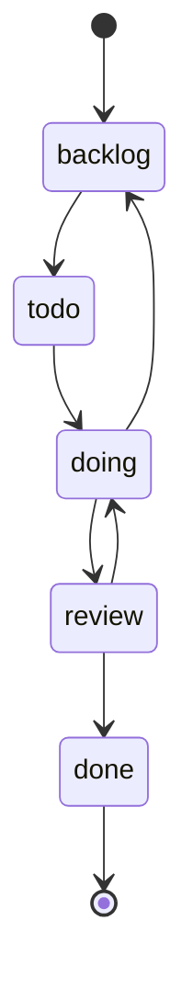

# Mission Control and tasks

Mission Control is Entity's task execution surface. It presents a board-oriented workflow for moving work across columns, inspecting task detail, review state, comments, activity, and handoff metadata. The server backs that surface with task routes, review logic, claims, receipts, activity events, stricter task-create scope validation, org/team-scoped admin reporting, and tenant-aware chat and workspace mutations.

## What users can do

- create, edit, and move tasks across the workspace lifecycle columns;
- filter and page task lists;
- inspect activity history and task metadata;
- claim policy-drivable work through Task Master behavior;
- complete tasks with canonical receipts and proof artifacts;
- route work through review gates when policy requires it;
- inspect duplicates and stale-work signals;
- create tasks with org/team/project aliases when the source payload uses either snake_case or camelCase scope keys;
- rely on the server to resolve an unambiguous default team when an org has exactly one active team;
- seed sample tasks only when explicit opt-in flags are set;
- read admin report aliases while preserving the ordinary report routes;
- use chat and workspace changes that remain exact-team aware rather than widening scope silently.

## Main implementation seams

- `packages/app/src/App.tsx` loads `TaskBoard`, `MCStrategicView`, `MCCreateTaskModal`, and the task detail panels.
- `packages/app/src/components/mission-control/utils/taskPriorityPolicy.ts` defines the canonical task priority policy shared by task entry points and the wiki anchor.
- `packages/server/src/routes/tasks.ts` exposes the task list and task mutation endpoints, including task-create scope normalization and default-team resolution.
- `packages/server/src/routes/sample-tasks.ts` and `packages/server/src/routes/sample-seed-config.ts` gate sample task creation behind explicit seed opt-in values.
- `packages/server/src/routes/admin-reports.ts` keeps the short report routes and the `/reports/*` aliases in sync.
- `packages/db/src/admin-reports.ts` scopes report queries by org and team.
- `packages/db/src/chat.ts` stores tenant-aware chat categories, channels, messages, and threads.
- `packages/server/src/routes/workspace.ts` and `packages/server/src/routes/chat.ts` enforce exact-team and org-aware mutation permissions.
- `packages/server/src/task-master-claims.ts` handles Task Master claim transitions and emits claim activity.
- `packages/server/src/receipt-writer.ts` generates canonical task receipts and records failure recovery state.
- `packages/server/src/activity-events.ts` records structured activity events used by the task timeline and notifications.
- `packages/server/src/routes/task-create-scope.test.ts` and `packages/server/src/routes/tasks.ts` capture the task-create scope validation and default-team resolution behavior.
- `packages/server/src/task-accountability.ts`, `packages/server/src/task-output-links.ts`, and `packages/server/src/task-dedupe.ts` handle accountability updates, output-link normalization, and duplicate detection used by task mutations and task detail flows.
- `packages/db/src/index.ts` defines the task columns, review policy shapes, and related records.

## Task priorities

The task priority policy is canonicalized in `packages/app/src/components/mission-control/utils/taskPriorityPolicy.ts` and published for the wiki at the `task-priorities` anchor.

- `P0 — Incident / hard deadline`: production outages, security or data-loss risk, legal or compliance deadlines, and customer-critical failures. Example: restore task data after a failed migration.
- `P1 — Project outcome`: a user, customer, product, release, or decision outcome for the project's current goal. Example: ship onboarding that a pilot customer can complete end to end.
- `P2 — Direct unblocker (default)`: the shortest task that unlocks a P1 outcome, or a high-consequence operating obligation. Example: fix the build break blocking a release task.
- `P3 — Engineering / maintenance / exploration`: implementation subtasks, refactors, tests, infrastructure, tooling, research, cleanup, and side-project work by default. Example: add tests for the board task filter.

General board filtering is separate from task priority. General boards use `excludeWorkDomains` engineering, while Engineering boards positively include engineering work. Priority does not override those board filters. When a board is customized from the default, existing exclusions are preserved; adding an explicit include for a work domain removes only that matching exclusion. The new seeded General boards now omit engineering by default, but the code does not automatically rewrite any existing General filter because historical timestamps cannot prove whether a board was customized. There is no new explicit-filter marker migration, and task-priority changes do not trigger a board migration.

## Task lifecycle

The task model is not just a to-do list. The code shows a lifecycle with explicit columns, active work, review states, receipts, and policy gating. `entity.config.example.yaml` seeds the default columns as `todo`, `doing`, `review`, and `done`, while `packages/db/src/index.ts` also recognizes `backlog` as a task column in the shared model.

The server's task routes support list, stale-task inspection, duplicate search, project assignment, accountability updates, task-create scope validation, and task state transitions. The route layer also enforces limits such as explicit pagination, normalized `work_domain` filtering, and bounded activity loading.

Caption: the canonical task columns visible in the shared model and config, with review and done as explicit terminal stages in the workspace flow.

## Task Master and receipts

`packages/server/src/task-master-claims.ts` turns an unassigned, policy-drivable task into a claim record and then records a structured activity event with the previous and current task state. `packages/server/src/receipt-writer.ts` goes further by generating a canonical receipt for completed tasks and marking failures back onto the task when the receipt pipeline cannot finish.

That means the task system distinguishes between:

- normal task edits;
- agent or Task Master claims;
- review-gated completions;
- receipt generation and evidence capture;
- failure recovery when receipt creation fails.

## Comments, reviews, handoffs, and create scope

The main task router imports comment mention response, review validation, output link normalization, task accountability helpers, and the task-create scope helpers used by the cloud adapter path. The code indicates that comments and review are not separate afterthoughts: they are part of the task transition path, especially when moving between active work and review-sensitive completion.

Task creation is now deliberately scope-aware. `packages/server/src/routes/task-create-scope.test.ts` shows that the HTTP create route accepts either `org_id`/`team_id` or `orgId`/`teamId`, normalizes them into a single scope object, and refuses mismatched aliases. When an org has exactly one active team, the server resolves that team automatically; when an org has none or more than one active team, creation fails closed until the caller supplies an explicit team. `packages/app/src/components/mission-control/taskCreateDefaults.ts` and `packages/app/src/components/mission-control/MCCreateTaskModal.tsx` add a product-side default for engineering work: when the work domain is `engineering`, the modal preselects the canonical `entity-engineering` project and blocks submission with an explicit error if that project is unavailable. `packages/app/src/components/mission-control/projectOptions.ts` keeps the project picker aligned with work-domain-aware options from the `/projects` payload.

Task-output navigation now preserves explicit link scope and fragment anchors while still filling in the selected task organization when a link omits `org`. `packages/app/src/lib/taskOutputDocTarget.ts` scopes the resolved navigation target at the Doc Hub boundary, and the task-output tests cover both explicit `?org=` links and the fallback path that rewrites unscoped links to the current task org without dropping `#section` fragments. The server-side half of this contract lives in `packages/server/src/task-output-links.ts`: links that already point at `/docs/source/<sourceId>/...` Entity docs URLs keep their exact path and only have their origin re-anchored, so artifact links stay stable across task saves. That normalization behavior is documented in detail in [Mission Control](../mission-control.md#task-output-link-normalization).

Sample tasks are only seeded when `ENTITY_SEED_SAMPLE_DATA` is explicitly set to an opt-in value such as `1`, `true`, `on`, or `yes`. That keeps the shipped workspace from auto-populating demo work unless an operator asks for it. Legacy Mission Control tasks are imported from the older database only when `ENTITY_SEED_MISSION_CONTROL_TASKS` is explicitly enabled, so the repository does not silently backfill that data on ordinary startups.

`packages/server/src/routes/admin-reports.ts` keeps the legacy `usage-report`, `audit-report`, and `access-report` routes while also exposing `/reports/usage`, `/reports/audit`, and `/reports/access` aliases for discoverability. The repository layer scopes those reports by org and team, so the aliases do not widen what the caller can see. Every usage, audit, access, and activity report alias is admin-authorized; ordinary activity listing remains available under its existing guard, but the admin report aliases are control-plane views.

Chat and workspace permissions are exact-scope aware. `packages/db/src/chat.ts` records org/team identifiers on chat categories, channels, messages, and threads, while `packages/server/src/routes/chat.ts` and `packages/server/src/routes/workspace.ts` rely on the request principal's exact team or org membership instead of silently broadening access. Creating an organization requires deployment-control authority (the trusted service/local admin path or a global admin). Updating an organization and creating its teams require manager or admin authority for that exact organization; renaming a team also accepts manager authority for that exact team. These checks are enforced by the canonical helpers in `packages/server/src/routes/workspace.ts`. The Admin UI creates a principal first and then applies its grant; if the grant retry fails, the created principal ID is retained and the current acting admin remains the actor for the retry path rather than the newly created target principal.

## Evidence to check before changing behavior

- `packages/server/src/routes/tasks.ts` for supported query filters and mutation endpoints.
- `packages/server/src/task-master-claims.ts` for claim semantics and activity side effects.
- `packages/server/src/receipt-writer.ts` for completion receipts and failure recovery.
- `packages/server/src/activity-events.ts` for the event payloads consumed by the UI.
- `packages/db/src/index.ts` and `entity.config.example.yaml` for the canonical task column model.
