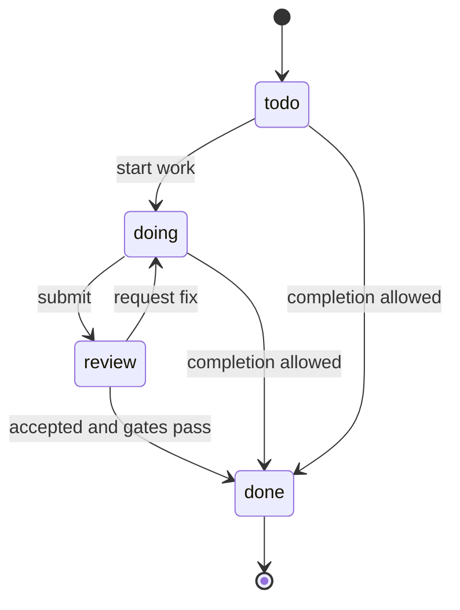
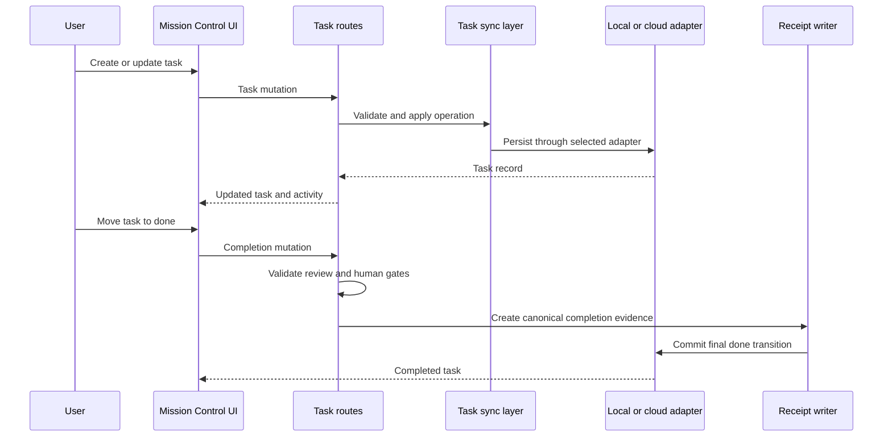

# Mission Control and task governance

Mission Control is Entity's work-management surface. Users can create and organize tasks, assign accountable principals, move work across columns, inspect history and outputs, discuss work, require review or human approval, and follow completion evidence. Task creation now has an engineering-specific default path that preselects the canonical `entity-engineering` project when the work domain is `engineering`, and it fails closed when that project is unavailable. Its main frontend seams are `TaskBoard.tsx`, `mission-control/TaskDetailPanel.tsx`, the Insights/Strategic/Ops views, and `hooks/useTaskBoard.ts`.

## User capabilities

- Kanban, Insights, and Strategic views with project, assignee, archive, and pagination behavior.
- Task creation, update, movement, deletion, dependencies/subtasks, projects, outputs, notes, activity, and duplicate handling.
- Threaded task comments, review acceptance/request-fix, human-gate request/approve/reject, and governance/provenance inspection.
- Offline optimistic create/update, queued writes, reconnect replay, and visible queued-change status.
- Task Master status/settings/trigger/log and task claim behavior where configured.
- Plugin-owned Mission Control subviews when the plugin registry supplies a valid mount.

## Task lifecycle and gates

*Configured columns are flexible, but review and human-gate checks can reject a transition to `done`.*

Tasks persist both board fields and accountability/policy fields: org/team/project scope; creator, initiator, owner, and executor; assignment state; `taskmaster_drivable`; worktype; risk; agent trust; policy inputs; external side effects; review requirement/state; and human-gate requirement/state. See the [data architecture](../architecture/runtime-and-data.md#core-data-model).

### Review

Required review uses explicit review endpoints and can lock completion until accepted. Legacy or non-required decisions may be recorded through task metadata/general updates. Board-level `accept_done` also moves the task to Done. Task review is not the same as a document review run described in [Files and documents](files-and-documents.md).

### Human gates

The task detail panel calls request, approve, and reject endpoints. Governance UI presents eligibility, provenance, receipts, output/evidence artifacts, and external-document policy. Server validation remains authoritative; hiding a control is not an authorization boundary.

### Comments and handoffs

Task comments support replies. If the comments endpoint is absent, the frontend deliberately degrades by writing a task activity entry instead. That preserves a visible record but is not equivalent to a persisted threaded comment.

“Continue work” currently records activity with `type: "handoff"` and selected context. It does **not** itself invoke a runtime or prove execution. A follow-up action creates a separate task and activity record. Runtime execution, when used, belongs to [Swarm and provider contracts](../platform/execution-and-proof.md).

## Request and persistence flow

*Completion is a governed server flow; canonical receipt creation can precede the final `done` mutation.*

Core route seams include `packages/server/src/routes/tasks.ts`, `task-review-gates.ts`, helpers/accountability/claims modules, and canonical plus legacy task mounts in `packages/server/src/index.ts`. `packages/server/src/routes/tasks.ts` now also carries strict task-create scope validation and normalized `work_domain` filtering for list requests. Persistence is adapter-neutral through `packages/db/src/task-sync.ts`, but only task operations use this local/cloud abstraction.

## Task Master

Task Master is bounded automation, separate from Swarm. `packages/server/src/agent/` implements stale-task, review-hygiene, ownership, and missing-output scans, optional language-model generation, bounded tools, agent logs, and structured activity. The scheduler interval is 30 minutes and `ENTITY_AGENT_ENABLED` defaults to false.

Model configuration is exposed through Admin and `PATCH /api/agent/settings`. If no usable key/model exists, pickup can still work and mention responders can post a graceful configuration message while generated text is skipped. See [Configuration and plugins](../platform/configuration-and-plugins.md#model-settings).

## Offline, create-scope, and degraded behavior

`useTaskBoard.ts` caches tasks, creates optimistic offline records, queues writes, and merges/replays changes after reconnection. This is client resilience, not proof that the server accepted the final state. Activity uses WebSocket updates with polling fallback through the [agent/activity surface](agents-and-collaboration.md).

Mission Control's create flow is intentionally narrow for engineering work: `packages/app/src/components/mission-control/taskCreateDefaults.ts` and `packages/app/src/components/mission-control/MCCreateTaskModal.tsx` preselect the canonical `entity-engineering` project for `engineering` work domains, while `packages/server/src/routes/task-create-scope.test.ts` shows the HTTP create route preserving org/team/project scope and rejecting malformed or out-of-hierarchy defaults. `packages/app/src/components/mission-control/projectOptions.ts` keeps the picker aligned with work-domain-aware project options from the `/projects` payload.

Several `mission-control/` extraction components currently return `null`; active behavior remains in the large board/detail/MC view components. Do not infer an implemented screen solely from a placeholder filename.

## Change and test guidance

- Board/data mutations: inspect `useTaskBoard.ts`, both task route mounts, `task-sync.ts`, and repository tests.
- Governance: inspect `TaskDetailPanel.tsx`, `GovernanceSection.tsx`, review-action helpers, `task-accountability.ts`, `task-master-claims.ts`, and receipt tests.
- Output links: verify Doc Hub and standalone document routing.
- Task deletion: remember SQLite can reuse plain integer task IDs; repository deletion purges child comments, project links, and task-scoped activity to avoid inherited state.

Run app build, server build/Vitest, and browser proof for mutation, review, gate, comment fallback, offline/reconnect, and deep-link behavior. High-risk authority, receipt, provider, or dangerous-action changes require the repository's adversarial review gates described in [Security and release](../operations/security-and-release.md).
