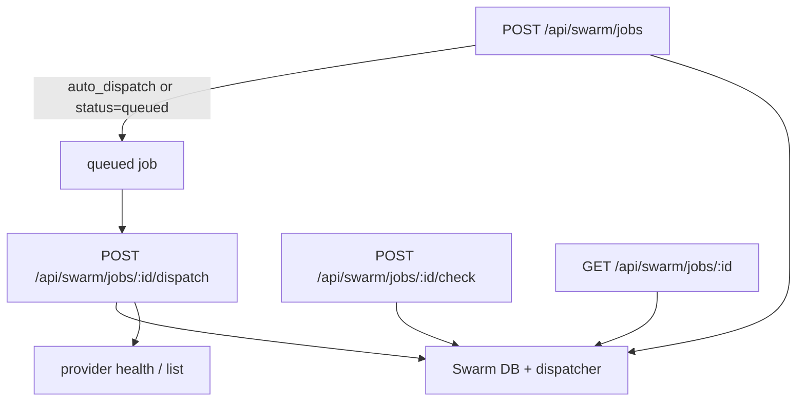

# Swarm, plugins, and admin

This part of Entity covers execution jobs, provider health, proof artifacts, plugin settings, and administrative controls. The source shows a split between the Swarm execution engine, the plugin registry, and runtime configuration that can be seeded from config or adjusted through admin routes.

## What users and operators can do

- create, inspect, update, dispatch, and delete Swarm jobs;
- check provider health and job status;
- inspect proofs attached to Swarm jobs;
- list, enable, and update plugin settings;
- configure runtime services and provider settings through the admin model;
- understand whether a feature is implemented, stubbed, or only partially wired.

## Main implementation seams

- `packages/server/src/swarm/routes.ts` is the main API surface for Swarm jobs, dispatch, status checks, and proofs.
- `packages/server/src/swarm/db.ts`, `packages/server/src/swarm/dispatcher.ts`, and `packages/server/src/swarm/healer.ts` provide persistence and worker orchestration.
- `packages/server/src/plugins/routes.ts` exposes plugin list, toggle, settings, restart, and install endpoints.
- `packages/server/src/plugins/registry.ts` and `packages/server/src/plugins/migrations.ts` own runtime plugin loading and storage.
- `packages/server/src/config/runtime.ts` and `entity.config.example.yaml` provide the configuration seam for services, providers, and plugin defaults.
- `packages/app/src/views/AdminView.tsx` is the primary admin surface in the UI.

## Swarm execution model

`packages/server/src/swarm/routes.ts` shows a job-oriented API. A job can be created with a title/spec/repo/branch/provider combination or a lighter `task_id` plus summary input. The router can queue a job automatically, dispatch it, check status, update it, and list attached proofs.

Caption: Swarm jobs move through persistence, dispatch, status checks, and proof attachment rather than through a single stateless request.

## Plugin management and a current limitation

The plugin management router supports listing plugins, toggling enablement, updating settings, and a restart no-op. The install endpoint is intentionally not complete: it validates GitHub repository URLs but returns `501` for actual install-from-GitHub behavior. That is a concrete example of how the wiki should distinguish implemented features from partially wired flows.

## Admin-configurable behavior

`entity.config.example.yaml` shows where the product expects admin/runtime defaults to come from:

- `services` and `providers` are present but empty by default;
- the `entity-services` plugin has settings for base URLs and discovery flags;
- `deploy.mode`, `preserveDatabase`, and `dryRunByDefault` are already modeled;
- voice provider defaults exist, including `browser` as the default provider.

The app's admin view is therefore the place to expose and edit these runtime knobs, but the source of truth for the underlying behavior still lives in the server config and plugin registry. Recent changes also added a Users & roles section to Admin, so the same shell now manages stored principals, scoped grants, and the bootstrap admin path. That admin access model is stored-principal backed, with a localhost-only compatibility fallback for legacy setups.

## Evidence to check before changing behavior

- `packages/server/src/swarm/routes.ts` for the job API and proof flow.
- `packages/server/src/plugins/routes.ts` for plugin management semantics.
- `packages/server/src/plugins/registry.ts` for runtime enablement and settings storage.
- `packages/server/src/config/runtime.ts` and `entity.config.example.yaml` for config-backed defaults.
- `packages/app/src/views/AdminView.tsx` for the user-facing admin entrypoint.
