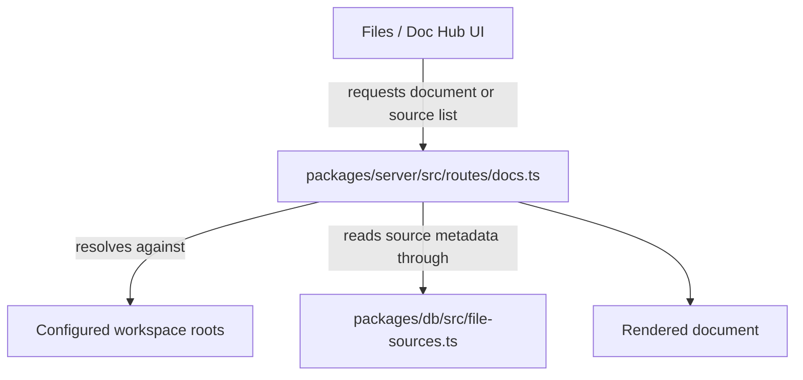

# Workspace and files

Entity treats files and documents as first-class workspace objects. The main UI exposes file browsing, document editing, file history, search, source switching, and scoped uploads, while the server resolves those requests against allowed workspace roots, registered file sources, and ownership-scoped write rules. When multi-source browsing is enabled, the Files / Doc Hub home is the unified dashboard rather than a single-root browser, so browsing, search, and upload scope all stay tied to the selected organization and canonical route state.

## What users can do

- browse local and configured sources from the Files / Doc Hub experience;
- open markdown and other allowed document types in the workspace;
- switch between multiple file sources rather than a single hardcoded root;
- inspect history and derived document metadata when the UI exposes it;
- create uploads with an explicit org, team, or org-wide scope when the source is writable and the caller is authorized;
- keep the selected organization context when reopening files, switching tabs, or returning through legacy links;
- on mobile, closing the active document clears the document-specific organization state while the independent browser organization remains selected, so subsequent Quick Switcher searches continue to use the current browser scope;
- use desktop and mobile shells to reach the same server-backed file workspace;
- choose an organization before using the unified dashboard or quick switcher, because unscoped browsing and search stay blocked until that choice is made.

## Main implementation seams

- `packages/app/src/App.tsx` lazy-loads `FilesView`, `FileTree`, `SourceFileTree`, `FileHistoryPanel`, `DocsRouteView`, and the document collaboration surfaces.
- `packages/app/src/components/UnifiedFileDashboard.tsx`, `packages/app/src/components/QuickSwitcher.tsx`, `packages/app/src/lib/legacyFileScope.ts`, `packages/app/src/lib/quickSwitcherScope.ts`, `packages/app/src/lib/unifiedFileSearch.ts`, and `packages/app/src/lib/uploadScope.ts` keep dashboard browsing, quick switcher search, search identity, and uploads scoped to the selected organization.
- `packages/server/src/routes/docs.ts` serves documents from a constrained allow-list of roots and file types.
- `packages/server/src/routes/legacy-files.ts` supports older file routes that still need compatibility handling.
- `packages/server/src/fs/routes-upload.ts`, `packages/server/src/fs/ownership.ts`, and `packages/db/src/file-ownership.ts` enforce scoped uploads and ownership-backed writes.
- `packages/server/src/fs/routes-search.ts` enforces the indexed-search scan cap and returns a narrowing error once the 1000-candidate budget is exhausted.
- `packages/server/src/fs/routes-files.ts` resolves tree and file access through active-folder and physical-alias ownership checks, while `packages/server/src/fs/adapters/local.ts` preserves raw bytes for binary uploads and uses UTF-8 strings for textual writes. The tree and upload ownership path now checks every physical alias, including disabled or nested local roots, before parent work proceeds and again after adapter awaits, and the organization equality check happens before the admin bypass so bound admin context cannot widen the scope across orgs.
- `packages/server/src/document-objects.ts` and `packages/db/src/file-sources.ts` carry document and file-source persistence details.
- `entity.config.example.yaml` defines the default local file sources and the allowed document extensions. The sample `entity-wiki` source now points at `./openwiki-html`, which matches the generated presentation tree used by the runtime docs flow and the file-source bootstrap path documented in [Admin and extensions](admin-and-extensions.md). The server-side docs/index pipeline strips the generated HTML before it derives previews, so the rendered wiki stays searchable even though the on-disk presentation tree is HTML. The file viewer now treats `entity-wiki` HTML as a static preview source with a scriptless sandbox, while other HTML sources keep the interactive preview sandbox; that policy lives in `packages/app/src/lib/htmlPreviewPolicy.ts` and is consumed by the file viewer, document editor, and mobile shell. Search fallback now prunes ownership-invisible folders before those folders can consume the visible-result budget, and it returns an explicit `search_scope_scan_limit` narrowing error once the 1,000-candidate scan budget or traversal limits are exhausted instead of silently truncating matches. Upload reservations now inspect every physical alias, including disabled or nested local roots, before parent work continues and again after adapter awaits, and ownership resolution checks organization equality before the file-ownership admin bypass so a bound admin identity cannot widen a cross-org reservation.

## File-source configuration

The sample config shows two built-in local file sources:

- `workspace` at `./workspace`;
- `entity-wiki` at `./openwiki-html`.

Those sources are enabled by default in the example config and bound to the sample assistant agent. The config also defines allowed document extensions for the docs surface, including markdown, text, JSON, YAML, CSV, TSV, and log-like files. When uploads are enabled, the browser asks for an explicit org and team scope instead of silently choosing the first team, and the server only accepts that scope when the caller has the matching authority. The dashboard and source sidebar now wait for the active organization before they browse or search, and the quick switcher forwards that same org context into its search requests. The upload path preserves the original bytes the browser provides, including BOM-bearing text, empty files, and arbitrary binary payloads, rather than re-encoding everything as UTF-8 text.

## How document serving works

`packages/server/src/routes/docs.ts` builds an allow-list of roots from workspace and docs fallback paths, then resolves requested document paths against those roots. That means the docs viewer is intentionally constrained: the server does not serve arbitrary filesystem paths, only files under configured roots and allowed extensions. The same read boundary is shared with `packages/server/src/fs/adapters/bounded-read.ts`, which keeps local reads, HTTP markdown reads, and docsify-adjacent reads on the same 16 MiB ceiling so the UI and indexing path fail the same way for oversized content. The upload and conversion routes reuse the same source-scope rules, so the file dashboard, quick switcher, and document editor preserve the selected organization when tabs reopen or searches are refreshed. The unified dashboard and quick switcher now stay blocked until an organization is selected, and the search identity is rebuilt from the active org plus source, type, origin, agent, and refresh nonce so stale results cannot leak across scopes.

The key security idea is that the server, not the browser, decides what files can be read.

## Degraded or compatibility states

- The docs route contains legacy roots for older layouts, so the app can still read some historical paths during migration. The recent local URL round-trip correction keeps those legacy links stable when the browser navigates back through history: selected organization context and absolute workspace file paths survive the round-trip instead of being rewritten into a looser fallback path. When the active document closes, the document-specific organization is cleared, but the independent file-browser organization stays selected; that lets the Quick Switcher continue searching in the current browser scope instead of inheriting a stale document scope. The legacy file-organization chooser and the independent sidebar browsing scope follow the same preservation rule, so source-less tabs and stale searches do not replace the selected organization. Activity and file-open events keep the recorded event organization, with the selected browser organization used only as a fallback for older unscoped events. Opening task documents and file-history documents now preserves that independent browser organization rather than reusing the document-scoped one, so returning to Files does not collapse the browser context back into the task or history view. Opening task documents and file-history documents now preserves that independent browser organization rather than reusing the document-scoped one, so returning to Files does not collapse the browser context back into the task or history view.
- The directory capability logic now consults the active folder and its physical aliases for local sources, so browsing a tree stays aligned with the actual filesystem root rather than only the logical source path.
- The `entity-wiki` file source in `entity.config.example.yaml` now points at `./openwiki-html`, and the generated HTML tree is what the docs indexing pipeline reads after stripping markup and entities for previews.
- The UI contains lazy-loading fallbacks, which means the file experience can render skeleton states while bundles load.
- The file browsing model is source-driven, so an empty or misconfigured source list produces a reduced workspace rather than a hard crash. The quick switcher and unified search helpers now carry the active organization into the request identity and fetch path, which keeps stale results from crossing an org change while the file shell itself preserves the browser-scoped organization across tab, close, and return flows.
- Writable sources still fail closed when the caller lacks the required grant, and the convert dialog reports the same source-availability boundary as the file browser instead of pretending that a read-only source can be promoted.
- Ownership moves stay blocked even within the same scope when the target path would move an owned file or one of its descendants, so a caller cannot sidestep ownership by renaming around the reservation.
- Document URLs round-trip arbitrary trimmed organization IDs through the existing `orgId` query/body fields, while only ASCII IDs use the compatibility headers; that keeps document links canonical without inventing a second organization lookup path.

## Evidence to check before changing behavior

- `README.md` for the intended local-first file workspace story.
- `entity.config.example.yaml` for source and extension defaults.
- `packages/app/src/components/UnifiedFileDashboard.tsx` and `packages/app/src/components/QuickSwitcher.tsx` for org-scoped browsing and selection behavior.
- `packages/server/src/routes/docs.ts` for path allow-listing and root resolution.
- `packages/server/src/fs/routes-search.ts` for the indexed-search scan cap and narrowing error.
- `packages/server/src/fs/routes-upload.ts` and `packages/server/src/fs/ownership.ts` for scoped writes and ownership enforcement.
- `packages/server/src/fs/routes-files.ts` for tree/file ownership checks and byte-preserving read/write behavior.
- `packages/app/src/App.tsx` for the product surfaces that depend on file browsing.