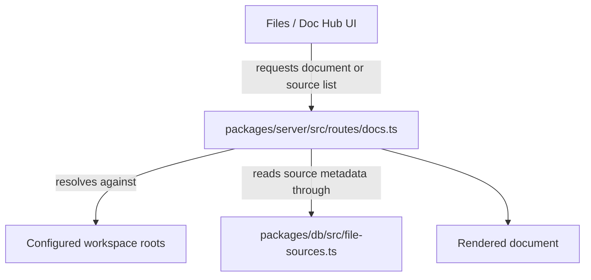

# Workspace and files

Entity treats files and documents as first-class workspace objects. The main UI exposes file browsing, document editing, file history, search, and source switching, while the server resolves those requests against allowed workspace roots and registered file sources.

## What users can do

- browse local and configured sources from the Files / Doc Hub experience;
- open markdown and other allowed document types in the workspace;
- switch between multiple file sources rather than a single hardcoded root;
- inspect history and derived document metadata when the UI exposes it;
- use desktop and mobile shells to reach the same server-backed file workspace.

## Main implementation seams

- `packages/app/src/App.tsx` lazy-loads `FilesView`, `FileTree`, `SourceFileTree`, `FileHistoryPanel`, `DocsRouteView`, and the document collaboration surfaces.
- `packages/server/src/routes/docs.ts` serves documents from a constrained allow-list of roots and file types.
- `packages/server/src/routes/legacy-files.ts` supports older file routes that still need compatibility handling.
- `packages/server/src/document-objects.ts` and `packages/db/src/file-sources.ts` carry document and file-source persistence details.
- `entity.config.example.yaml` defines the default local file sources and the allowed document extensions. The sample `entity-wiki` source now points at `./openwiki-html`, which matches the generated presentation tree used by the runtime docs flow and the file-source bootstrap path documented in [Admin and extensions](../admin-and-extensions.md). The server-side docs/index pipeline strips the generated HTML before it derives previews, so the rendered wiki stays searchable even though the on-disk presentation tree is HTML. The file viewer now treats `entity-wiki` HTML as a static preview source with a scriptless sandbox, while other HTML sources keep the interactive preview sandbox; that policy lives in `packages/app/src/lib/htmlPreviewPolicy.ts` and is consumed by the file viewer, document editor, and mobile shell.

## File-source configuration

The sample config shows two built-in local file sources:

- `workspace` at `./workspace`;
- `entity-wiki` at `./openwiki-html`.

Those sources are enabled by default in the example config and bound to the sample assistant agent. The config also defines allowed document extensions for the docs surface, including markdown, text, JSON, YAML, CSV, TSV, and log-like files.

## How document serving works

`packages/server/src/routes/docs.ts` builds an allow-list of roots from workspace and docs fallback paths, then resolves requested document paths against those roots. That means the docs viewer is intentionally constrained: the server does not serve arbitrary filesystem paths, only files under configured roots and allowed extensions. The same read boundary is shared with `packages/server/src/fs/adapters/bounded-read.ts`, which keeps local reads, HTTP markdown reads, and docsify-adjacent reads on the same 16 MiB ceiling so the UI and indexing path fail the same way for oversized content.

The key security idea is that the server, not the browser, decides what files can be read.

## Degraded or compatibility states

- The docs route contains legacy roots for older layouts, so the app can still read some historical paths during migration.
- The `entity-wiki` file source in `entity.config.example.yaml` now points at `./openwiki-html`, and the generated HTML tree is what the docs indexing pipeline reads after stripping markup and entities for previews.
- The UI contains lazy-loading fallbacks, which means the file experience can render skeleton states while bundles load.
- The file browsing model is source-driven, so an empty or misconfigured source list produces a reduced workspace rather than a hard crash.

## Evidence to check before changing behavior

- `README.md` for the intended local-first file workspace story.
- `entity.config.example.yaml` for source and extension defaults.
- `packages/server/src/routes/docs.ts` for path allow-listing and root resolution.
- `packages/app/src/App.tsx` for the product surfaces that depend on file browsing.
