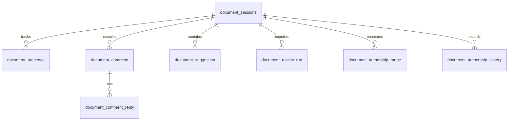

# Files and documents

The Files area is a shared workspace for browsing content from one or more sources, opening documents, editing markdown-like files, and keeping collaboration state attached to the document.

The main source seams are:

- `packages/app/src/views/FilesView.tsx` for the top-level Files route.
- `packages/app/src/components/UnifiedFileDashboard.tsx` for the multi-source browser.
- `packages/app/src/components/doc-hub/DocHubWorkspaceChrome.tsx` for the tabbed Doc Hub chrome.
- `packages/app/src/views/DocumentEditorView.tsx` and related editor components for editing, comments, suggestions, and review markers.
- `packages/server/src/routes/docs.ts`, `packages/server/src/routes/documents.ts`, and `packages/server/src/routes/search.ts` for document serving and document APIs.
- `packages/db/src/file-sources.ts` and `packages/db/src/document-collab.ts` for source registration and collaboration persistence.
- `packages/server/src/config/runtime.ts`, `packages/server/src/config/schema.ts`, `packages/server/src/fs/adapters/local.ts`, `packages/server/src/fs/adapters/http-markdown.ts`, `packages/server/src/fs/routes-sources.ts`, and `packages/server/src/fs/routes-files.ts` for bootstrap allowlisting, read-only enforcement, and remote raw-read handling on local and HTTP-backed file sources.

## What users can do

- Browse files from the workspace and other configured sources.
- Open documents in a tabbed Doc Hub shell.
- Edit content in the document editor.
- Read markdown previews and file history.
- Switch between file sources when multi-source browsing is enabled.
- See comments, suggestions, presence, authorship ranges, and review runs attached to the document.
- Use text-to-speech controls for document reading where enabled.

## Unified file browsing

`FilesView` decides whether the user sees the unified dashboard or a simpler “select a file” fallback. The decision is controlled by the runtime flag exposed to the view as `fsMultiSourceEnabled`.

When multi-source browsing is enabled, the UI renders `UnifiedFileDashboard`, which is the product’s primary entry into source selection and file browsing. The dashboard and source tree are consistent with the file source registry in `packages/db/src/file-sources.ts`, which stores source type, base path, base URL, auth type, enabled state, icon, health, and sync timestamps.

The example config in `entity.config.example.yaml` shows two local sources by default: `workspace` and `entity-wiki`. The wiki source is declared `readOnly: true`, and runtime bootstrap adds configured local file-source roots to `ENTITY_FS_LOCAL_SOURCE_ROOTS` so the allowlist covers trusted roots before the adapter enforces read-only behavior. The effective-config path now reconstructs stored capabilities into `readOnly`, so Admin and file-source views stay aligned with the Entity Wiki bootstrap contract.

## Doc Hub and document editing

`DocHubWorkspaceChrome` keeps document tabs and top-level workspace actions together. It is the shell around the document editor, not the editor itself.

The editor-specific state is persisted in `packages/db/src/document-collab.ts`. That schema stores:

- document sessions;
- authorship ranges and history;
- presence records;
- comments and replies;
- suggestions with open/accepted/rejected state;
- review runs with pending/running/completed/failed state.

That collaboration layer is what makes the Files surface more than a file browser: it is the shared document state that the UI can render and the server can validate.

## Document serving and access control

`packages/server/src/routes/docs.ts` resolves document paths from several allowed roots, including workspace-backed candidates and legacy fallback roots. It rejects path traversal and only allows text-oriented file extensions.

`packages/server/src/routes/documents.ts` adds the document-specific API surface. That route is where document sessions, blocks, presence, snapshots, events, and share-token authorization are handled.

The file indexer now strips HTML wrappers, decodes entities, and stores readable titles and previews for generated wiki pages, so the presentation tree remains searchable as text instead of raw markup. That behavior lives in `packages/server/src/fs/index-runner.ts` and is covered by indexing tests for generated HTML content.

The access model is explicit:

- public documents are readable without a share token;
- shared/private documents require a valid token from the `Authorization: Bearer ...` header, `X-Share-Token`, or `?token=` query parameter;
- document edits and events are persisted in SQLite-backed tables.

Local file sources add another boundary: the server seeds trusted local roots into `ENTITY_FS_LOCAL_SOURCE_ROOTS` during bootstrap, the local adapter reports `readOnly` in stored capabilities, and `packages/server/src/fs/routes-files.ts` rejects write requests when the adapter says the source is read-only. The adapter itself also blocks direct `write` and `mkdir` calls for read-only sources, so both the HTTP surface and the adapter layer enforce the same contract. The HTTP markdown adapter follows the same read-only rule, but its `readRaw` path can still return binary content and the file route will flag the payload as `isBinary` when the text read path rejects a non-text resource. The file-source API also refuses to delete config-managed local sources and preserves the `entity.config.yaml` source marker on updates, which closes the delete/recreate path that could otherwise bypass the trusted read-only policy. New local source registrations also inherit read-only policy when their root overlaps any protected read-only local root, so same-root, parent, and child aliases cannot be used to regain writes around a trusted wiki source.

## Change notes for future agents

When changing Files / Doc Hub, check these seams together:

1. `packages/app/src/views/FilesView.tsx` and `packages/app/src/components/UnifiedFileDashboard.tsx` for navigation and source selection.
2. `packages/app/src/views/DocumentEditorView.tsx` and `packages/app/src/components/doc-hub/DocHubWorkspaceChrome.tsx` for editing and tabs.
3. `packages/server/src/routes/docs.ts` and `packages/server/src/routes/documents.ts` for serving and authorization.
4. `packages/db/src/file-sources.ts` and `packages/db/src/document-collab.ts` for persistence.

If you change the allowed document file types or auth model, update the server route and the UI together so the workspace does not offer a capability the backend rejects.
