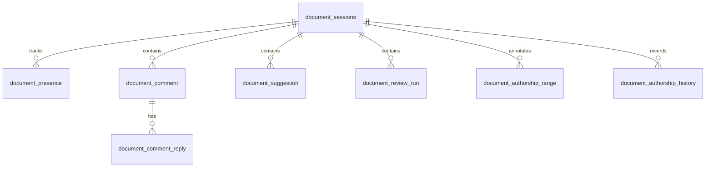

# Files and documents

The Files area is a shared workspace for browsing content from one or more sources, opening documents, editing markdown-like files, and keeping collaboration state attached to the document. It is the user-facing surface that consumes the file-source, read-only bootstrap, and bounded-read rules documented in [Admin and extensions](admin-and-extensions.md) and [Configuration, Admin, Plugins, and Services](platform/configuration-and-plugins.md).

The main source seams are:

- `packages/app/src/views/FilesView.tsx` for the top-level Files route.
- `packages/app/src/components/UnifiedFileDashboard.tsx` and `packages/app/src/components/QuickSwitcher.tsx` for the multi-source browser and source-sensitive reopen flow.
- `packages/app/src/components/doc-hub/DocHubWorkspaceChrome.tsx` for the tabbed Doc Hub chrome.
- `packages/app/src/views/DocumentEditorView.tsx` and related editor components for editing, comments, suggestions, and review markers.
- `packages/app/src/components/doc-hub/DocumentConvertDialog.tsx` for document conversion and derivative creation.
- `packages/app/src/components/document-integrations/ProviderSettings.tsx` and `packages/app/src/components/settings/DocsSettings.tsx` for document-provider configuration in Admin.
- `packages/server/src/routes/document-integrations.ts`, `packages/server/src/document-providers/*`, and `packages/db/src/document-integrations.ts` for the provider-neutral document API, provider adapters, write policy, and integration persistence.
- `packages/server/src/routes/docs.ts`, `packages/server/src/routes/documents.ts`, `packages/server/src/routes/search.ts`, `packages/server/src/fs/routes-search.ts`, and `packages/server/src/fs/routes-files.ts` for document serving, search, and document APIs.
- `packages/db/src/file-sources.ts`, `packages/db/src/file-ownership.ts`, `packages/server/src/fs/ownership.ts`, `packages/server/src/fs/routes-upload.ts`, and `packages/db/src/document-collab.ts` for source registration, upload ownership, and collaboration persistence.
- `packages/server/src/config/runtime.ts`, `packages/server/src/config/schema.ts`, `packages/server/src/fs/adapters/local.ts`, `packages/server/src/fs/adapters/http-markdown.ts`, `packages/server/src/fs/adapters/bounded-read.ts`, `packages/server/src/fs/routes-sources.ts`, and `packages/server/src/fs/routes-files.ts` for bootstrap allowlisting, read-only enforcement, bounded reads, and remote raw-read handling on local and HTTP-backed file sources. The local adapter now reuses a pooled managed-storage broker per executable and root, keeps the startup-root validation on `.` only, preserves typed missing-root and invalid-path messages, and applies the same 16 MiB ceiling as the other adapters; `packages/server/src/fs/managed-storage-broker.ts` and its tests document the fail-closed client lifecycle and root-bound IPC contract.

## What users can do

- Browse files from the workspace and other configured sources.
- Open documents in a tabbed Doc Hub shell.
- Edit content in the document editor.
- Read markdown previews and file history.
- Switch between file sources when multi-source browsing is enabled.
- See comments, suggestions, presence, authorship ranges, and review runs attached to the document.
- Use text-to-speech controls for document reading where enabled.

## Unified file browsing

`FilesView` decides whether the user sees the unified dashboard or a simpler “select a file” fallback. The decision is controlled by the runtime flag exposed to the view as `fsMultiSourceEnabled`.

When multi-source browsing is enabled, the UI renders `UnifiedFileDashboard`, which is the product’s primary entry into source selection and file browsing. The dashboard and source tree are consistent with the file source registry in `packages/db/src/file-sources.ts`, which stores source type, base path, base URL, auth type, enabled state, icon, health, and sync timestamps.

The example config in `entity.config.example.yaml` shows two local sources by default: `workspace` and `entity-wiki`. The wiki source is declared `readOnly: true`, and runtime bootstrap adds configured local file-source roots to `ENTITY_FS_LOCAL_SOURCE_ROOTS` so the allowlist covers trusted roots before the adapter enforces read-only behavior. The effective-config path now reconstructs stored capabilities into `readOnly`, so Admin and file-source views stay aligned with the Entity Wiki bootstrap contract. The source surface now also carries the ownership and scope rules used by uploads: the browser-side upload chooser must select an explicit org, team, or org-wide scope, and the server validates that choice against the caller's authority before it reserves ownership and writes the file. Upload requests are now authenticated by the global bearer guard before the large JSON parser runs, so unauthorized callers cannot spend parser memory on the upload envelope. For storage, safe org and team IDs keep their historical upload paths, while IDs that are not safe bounded filesystem segments are encoded into a canonical `~SHA256` path segment; that same encoding is shared with ownership creation checks so the filesystem and reservation layers agree on the scoped path.

## Doc Hub and document editing

`DocHubWorkspaceChrome` keeps document tabs and top-level workspace actions together. It is the shell around the document editor, not the editor itself.

The editor-specific state is persisted in `packages/db/src/document-collab.ts`, while the document shell and mobile route helpers clear document-scoped state when the active document changes so the browser-scoped organization can persist independently. That schema stores:

- document sessions;
- authorship ranges and history;
- presence records;
- comments and replies;
- suggestions with open/accepted/rejected state;
- review runs with pending/running/completed/failed state.

That collaboration layer is what makes the Files surface more than a file browser: it is the shared document state that the UI can render and the server can validate.

## Document serving and access control

`packages/server/src/routes/docs.ts` resolves document paths from several allowed roots, including workspace-backed candidates and legacy fallback roots. It rejects path traversal and only allows text-oriented file extensions.

HTTP markdown sources now have two explicit discovery modes. Without a manifest they remain exact-read-only: users can open a known path, but the adapter does not claim list or search capability and `/api/sources` reports `searchability: "exact-read-only"`. When an `http-markdown` source is configured with `manifestPath` under its base URL, or a same-origin `manifestUrl` that stays under the source `baseUrl`, the adapter loads a version-1 manifest and reports `searchability: "manifest-backed"`. That manifest can drive `/api/fs/tree`, source sync, and `/api/fs/search` without giving the remote source write capability. The search path now uses the same source-scope and ownership checks as the file tree, so stale results cannot replace the selected organization or leak owner metadata into the uploaded-file view. Fallback search now prunes ownership-invisible folders before those folders consume the visible-result budget, and it returns the explicit `search_scope_scan_limit` narrowing error once the 1,000 raw-candidate limit or traversal limits are reached.

The manifest path is configured through the File Sources settings form and stored in the source capabilities JSON. The server enforces the safety contract in `packages/server/src/fs/adapters/http-markdown.ts` and `packages/server/src/fs/routes-sources.ts`: only one of `manifestPath` or `manifestUrl` is allowed, remote manifest URLs must be same-origin and below the base URL, the manifest is capped at 2 MiB and 10,000 files, each listed file is capped at 16 MiB, file paths must be normalized text paths, and duplicate or ambiguous file/directory-shadowing paths are rejected. This keeps remote Ada-style documentation searchable while preserving the adapter's read-only boundary.

`packages/server/src/routes/documents.ts` adds the document-specific API surface. That route is where document sessions, blocks, presence, snapshots, events, and share-token authorization are handled.

A shared bounded-read helper in `packages/server/src/fs/adapters/bounded-read.ts` now enforces a 16 MiB ceiling for file-source reads and remote text reads. `packages/server/src/fs/adapters/local.ts`, `packages/server/src/fs/adapters/http-markdown.ts`, and `packages/server/src/fs/adapters/docsify.ts` all call that helper so oversized content is rejected consistently instead of being buffered or concatenated blindly. `packages/server/src/fs/adapters/http-markdown.ts` also exposes a `readRaw` fallback for unsupported text content, returning binary metadata when the text read path refuses a non-text resource. The file route in `packages/server/src/fs/routes-files.ts` maps `SourceReadLimitError` to HTTP 413, so user-visible reads fail with a specific bounded-response instead of a generic server error, and the local adapter keeps the same limit in sync for direct filesystem reads. The legacy file routes now mirror that same boundary: `packages/server/src/routes/legacy-files.ts` uses the shared read-only source check to reject writes into read-only local source trees and aliases, and its coverage proves the nested alias case stays blocked even when the path is reached through a symlink. The file route also treats that HTTP markdown raw fallback as binary so the UI can display non-text resources without pretending they were textual markdown. The same read ceiling also matches the file-browsing boundary described in [Configuration, Admin, Plugins, and Services](platform/configuration-and-plugins.md), so source browsing, indexing, and the admin-configured file-source experience stay aligned.

Task-output navigation now preserves explicit link scope and fragment anchors while filling in the selected task organization for unscoped links. `packages/app/src/lib/taskOutputDocTarget.ts` resolves the target through the Doc Hub route helpers, and the task-output tests prove the `?org=` value stays untouched when it is already present while the fallback path injects the task org and keeps `#section` fragments intact. The same scope discipline also applies to physical-prefix reservation safety during directory moves: the move path re-checks the owning physical aliases before it writes, so a pending reservation or foreign local alias cannot be jumped around by a rename.

Local file sources add a stricter server-side boundary of their own. `packages/server/src/fs/adapters/local.ts` now keeps a per-executable, per-root managed-storage broker pool so repeated route requests and index scans reuse one child process instead of spawning a fresh broker for every adapter instance. That adapter still validates the bound startup root by calling the broker on `.` only, and it derives write capability from the configured base path plus the read-only source flag stored with the source record. If the broker reports a missing root, the adapter preserves the user-facing "Local source path does not exist." validation message; if the broker reports an invalid path, the adapter re-surfaces the existing "Access outside source root is not allowed." message for read failures. The same adapter now enforces the shared 16 MiB ceiling when no explicit `maxBytes` is supplied, so local filesystem reads fail with the same bounded-read error as the other source adapters. `packages/server/src/fs/managed-storage-broker.ts` implements the pooled child-process protocol, keeps each request root-bound by sending the executable plus startup root only once at launch, and now fails closed when spawn throws synchronously, emits an asynchronous child error, or exits while requests are pending. `packages/server/src/fs/managed-storage-broker.test.ts` proves the client pool reuses children for repeated acquires, evicts dead clients, and fails closed when spawn cannot start. `packages/server/src/fs/adapters/local.integration.test.ts` covers the adapter-facing behavior on the real native broker: symlink escapes are rejected, oversized reads stop at 16 MiB, and repeated route/index-style adapter operations keep broker creation bounded to one child per source root. `packages/server/src/fs/adapters/local.test.ts` covers the adapter-facing behavior in unit tests: broker reuse, root validation, typed read translations, and the oversized-read rejection path. `packages/server/src/fs/routes-files.ts` maps the shared read-limit error to HTTP 413 so the UI sees a bounded read failure rather than a generic server error. The upload route and ownership helpers now keep the selected org/team/org-wide scope explicit, reserve ownership before writing, and carry that scope through tree, search, file, and conversion paths so the file browser, quick switcher, and document editor all stay aligned after a reload or tab switch.

The broker hardening also affects route-level behavior. `packages/server/src/fs/routes-files.ts` maps the shared read-limit error to HTTP 413, so oversized local reads fail with a bounded response instead of a generic server error. `packages/server/src/routes/legacy-files.ts` continues to treat read-only local roots as immutable at the mutation boundary, and its realpath-aware overlap checks still prevent same-root, parent, and child aliases from sneaking writes into protected local sources.

The access model is explicit:

- public documents are readable without a share token;
- shared/private documents require a valid token from the `Authorization: Bearer ...` header, `X-Share-Token`, or `?token=` query parameter;
- document edits and events are persisted in SQLite-backed tables;
- uploaded files keep their owning org and team through reads, search, history, and conversion, and restricted results hide snippets and preview content instead of leaking metadata.

Local file sources add another boundary: the server seeds trusted local roots into `ENTITY_FS_LOCAL_SOURCE_ROOTS` during bootstrap, the local adapter reports `readOnly` in stored capabilities, and `packages/server/src/routes/docs.ts` rejects write requests when the adapter says the source is read-only. The adapter itself also blocks direct `write` and `mkdir` calls for read-only sources, so both the HTTP surface and the adapter layer enforce the same contract. The HTTP markdown adapter follows the same read-only rule, but its `readRaw` path can still return binary content and the file route will flag the payload as `isBinary` when the text read path rejects a non-text resource. The file-source API also refuses to delete config-managed local sources and preserves the `entity.config.yaml` source marker on updates, which closes the delete/recreate path that could otherwise bypass the trusted read-only policy. New local source registrations also inherit read-only policy when their root overlaps any protected read-only local root, so same-root, parent, and child aliases cannot be used to regain writes around a trusted wiki source. The local capability helper now reconstructs `readOnly` from stored capabilities so effective-config views and the adapter stay aligned even when the source record is persisted separately. The document-convert dialog now uses the same source-availability and ownership checks as file browsing, so a writable local source can still fail closed when the caller lacks the required grant. Closing an active document clears only the document shell's current organization; the browser-scoped organization remains selected so Quick Switcher searches continue in the current browser context after the close/back lifecycle resets the document surface.

## Task and document relationships

A task output can target Doc Hub or the standalone document route; the route resolver is tested in `packages/app/src/lib/taskOutputDocTarget.test.ts`. Document comments are range-anchored collaboration objects, while task comments belong to [Mission Control](mission-control.md). Document review runs produce findings that may be applied or ignored; task review gates govern task completion. Keep these models distinct in UI and API changes.

The agent registry can bind agents to file sources, so [agent identity](features/agents-and-collaboration.md) is also used to filter and attribute file work.

## Change and test guidance

Start with the owning surface rather than `App.tsx` unless navigation or shared state is involved. Relevant focused tests include:

- `packages/app/src/lib/fileSearchSort.test.ts`
- `packages/app/src/lib/openFileTabs.test.ts`
- `packages/app/src/lib/taskOutputDocTarget.test.ts`
- `packages/app/src/lib/__tests__/fileRestoreState.test.ts`
- `packages/server/src/document-objects.test.ts`
- tests under `packages/server/src/fs/` and `packages/server/src/editor/`

Build the app and run server Vitest. Browser-check search, source switching, open/close/restore, save behavior, task return navigation, restricted results, and the responsive layout; utility tests do not cover the full cross-package workflow.

## Scoped uploads and ownership

The Files dashboard supports new-file uploads into enabled, writable local sources. Users explicitly choose the organization and, when teams are available, a team or organization-wide scope; the UI never chooses the first team silently. Organization-wide selection is explicit and requires organization-wide contributor or administrator authority, and selected teams must be active in the selected organization. The server checks contributor-or-higher authority for the exact selected scope. Uploads preserve the original bytes the user provides for every selected file: the browser sends the file payload as base64, which keeps text bytes, BOMs, and non-UTF-8 encodings intact, while the API still accepts the legacy `file.text` option and encodes that supplied string as UTF-8. The decoded payload must stay within the 1 MiB upload limit. Read-only sources, disabled sources, invalid paths, existing destination files, and uploads larger than 1 MiB of decoded content are rejected. Empty text and binary files are accepted. The server resolves upload scope explicitly, preserves the task-selected organization when a priority help page is opened from Mission Control, and falls back to the available organization only when a task-create modal has no explicit or single-team scope to anchor it.

Uploads and same-server file mutations now pass through a process-wide admission guard in `packages/server/src/fs/mutation-guard.ts`. The guard has a shared-creation side and an exclusive-move side, spans validation and the mutation itself, and always releases in `finally` so callers do not hold the admission slot after a success, conflict, or failure. Concurrent creations remain allowed, but a move conflicts with any active creation or another move, and a creation conflicts with an active move. The three callers are `packages/server/src/fs/routes-upload.ts`, `packages/server/src/fs/routes-convert.ts`, and `packages/server/src/routes/legacy-files.ts`; they all return HTTP 409 on guard conflicts, so the client can retry once the in-flight mutation clears. This closes same-server upload-or-conversion versus directory-rename races, including races that involve physical source aliases, without claiming any coordination across separate server processes or external filesystem writers.

Ownership is still resolved across physically overlapping local source roots, including aliases, rather than trusting a source ID alone; local source aliases share canonical physical ownership, authorized directories remain visible without duplicate ownership records, and conflicting foreign or pending aliases stay hidden. Pending or orphaned reservations stay hidden; reserved paths without valid ownership fail closed, including generic writes. Read, raw-read, document, tree, search, indexing, folder, and conversion paths enforce the shared ownership boundary. Conversion preserves ownership. Legacy moves of any owned file, or any folder containing owned descendants, are rejected until ownership-preserving moves are supported. This applies even within the same organization or team. Deleting an owned file releases the matching ownership row only after the deletion succeeds, while ambiguous failed writes keep the protective reservation in place for reconciliation. Owned file contents are not broadcast over the global unscoped WebSocket channel. Ordinary unowned configured files retain their existing shared-source behavior. These protections are unchanged by the new upload-authentication ordering and hashed scope-segment storage; the only change is that unsafe org/team identifiers now map to a shared canonical storage segment before ownership is reserved or checked.

Legacy directory listings also authorize descendants before they are exposed and filter each child entry so foreign-team, pending, or orphan uploads stay hidden from the listing response. Search results for allowed uploaded files carry the correct owning org and team, while restricted results omit owner metadata and hide snippets and previews. Ownership moves stay blocked for owned files and for any folder containing owned descendants, even when the move stays inside the same org/team scope.

Opening, reloading, and switching uploaded-file tabs retain the selected organization in the canonical Doc Hub URL and in the subsequent file reads, saves, and raw previews. The tab key and route state carry `orgId`, and the canonical route builders preserve that scope while the document shell rebuilds the location on tab switches and reloads. The recent legacy local URL round-trip correction keeps selected organization and absolute workspace file paths intact when old file links pass through browser history, so the returned route still resolves against the same scoped source instead of drifting to an unscoped or relative path. The browser’s selected organization now also survives a document return independently of the open file, and document-share lifecycle identity includes organization so late stale manual share results are ignored after the document or session changes. The same route-state layer also clears stale organization parameters from legacy selected-source tool URLs when the target scope is omitted. On the current mobile shell, the share action uses the shared adapter and can fall back to a manual copy sheet that shows the canonical link when native share or clipboard access is unavailable; the desktop shell follows the same canonical Copy/Share organization continuity, and both shells clear stale URL scope explicitly to `null` when the active document changes so old share/copy state cannot leak across documents.

The implementation seams are `packages/app/src/lib/uploadScope.ts`, `packages/server/src/fs/routes-upload.ts`, `packages/server/src/fs/ownership.ts`, and `packages/db/src/file-ownership.ts`. Their colocated tests cover scope choices, exclusive creation, reservation failures, physical aliases, and ownership-aware consumers. The source tree, quick switcher, independent split panes, and mobile file refresh keep the selected organization context when reopening uploaded files; file, tree, history, related search, conversion, and independent panes retain that selected organization, and stale searches cannot replace the selected organization results. Sidebar cached results and pins stay isolated by organization so one org's file state does not bleed into another. Write and edit availability reflects both the source capability and the caller's authority, so a writable source still fails closed when the principal lacks the needed grant.
