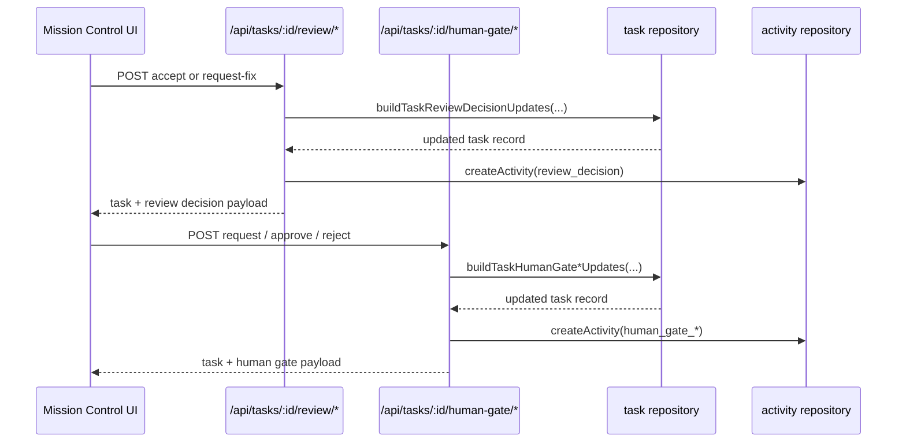

# Mission Control

Mission Control is the primary execution surface for the workspace. In the UI it appears as the task board plus task detail panel; on the server it is backed by task routes, review-gate routes, handoff routes, due-date reminder scans, and the task sync layer. Customizable Mission Control board navigation now filters out the `geordi-swarm` plugin so execution-only Swarm controls do not reappear as a standalone board tab, while the task-detail `Run with agents` action and the `/swarm/*` execution routes remain available inside Mission Control. Task handoffs are also part of this surface: the task detail panel now renders a dedicated `Handoffs` section via `TaskHandoffSection`, and the server exposes local handoff history, handoff creation, and rollback through `packages/server/src/routes/tasks.ts`, with board/detail UI refreshes when those mutations broadcast updates. Due-date reminders are part of the same task workflow: `packages/server/src/due-reminders.ts` scans open tasks in backlog, todo, doing, and review, classifies them into `due-soon` and `overdue` stages, sends `task_nudge` notifications to deduplicated recipients in assignee, executor, owner, then initiator order, and uses canonical event ids of the form `due-reminder:{taskId}:{kind}:{dueDate}` so retries, duplicate scans, and scheduler restarts stay idempotent while a moved due date re-notifies. `packages/server/src/index.ts` starts the due-reminder scheduler during server boot, before the workspace routes mount, so scans can begin as soon as the server is live. The implemented handoff path is local-only: requests that set `mode=cloud` fail closed with `503 cloud_handoffs_unavailable` before any local task or repository access, and the read endpoint returns a merged `history` view alongside the direct `handoffs`, `incoming`, and `outgoing` arrays so the client can keep one ordering path while still marking only direct handoffs as rollback-capable.

The important source seams are:

- `packages/app/src/components/mission-control/*` for the board, detail drawer, review actions, and task creation UI.
- `packages/server/src/routes/tasks.ts` for task listing, filtering, stale detection, duplicate detection, owner inboxes, and task mutations.
- `packages/server/src/due-reminders.ts` for due-date reminder stages, canonical event ids, and notification routing; `packages/server/src/index.ts` starts the scheduler during server boot.
- `packages/server/src/routes/task-review-gates.ts` for review acceptance, fix requests, human-gate requests, and human-gate decisions.
- `packages/db/src/index.ts` for task columns, policy envelopes, worktype registry, review-state fields, and task metadata.
- `packages/db/src/task-sync.ts` for local/cloud adapter selection.

## What users can do

- Move tasks across the `backlog`, `todo`, `doing`, `review`, and `done` columns.
- Create tasks and inspect detail, including assignee, priority, due date, model, estimates, attachments, dependencies, and activity.
- Mark work as blocked and carry blocker reasons.
- Review work, request fixes, and pass human-gate decisions.
- Inspect comments, subtasks, and related context in the task detail panel.
- Identify stale work and owner inbox items.
- Surface duplicate task candidates before creating more work.
- Observe receipts and proof state for task completion and external side effects.

## How the surface is wired

The task board comes from `packages/app/src/components/TaskBoard.tsx` and the mission-control subcomponents. The detail panel in `packages/app/src/components/mission-control/TaskDetailPanel.tsx` shows a richer record than a simple kanban card: it reads task metadata, review state, policy reason chains, activity, comments, dependencies, attachments, and proof views.

On the server, `packages/server/src/routes/tasks.ts` provides the data and mutation APIs that keep the board and detail panel in sync. That file also contains filters that matter operationally:

- `?column=` for a single column;
- `?columns=` and `?excludeColumns=` for multiple-column filters;
- `?project=` for project scoping;
- `?includeActivity=true` for embedded activity, with an explicit small-limit guard.

## Review and human-gate lifecycle

The review flow is intentionally separate from a bare task status change. Review state and human-gate state are tracked on the task record, and the server gates those transitions through explicit review endpoints.

This flow is backed by `packages/server/src/routes/task-review-gates.ts` and the task fields in `packages/db/src/index.ts`.

## Handoffs and rollback

Mission Control now includes a task-handoff workflow on the same task record that powers assignment and review. The task detail panel surfaces that workflow in the dedicated `Handoffs` section, where `TaskHandoffSection` lets users switch between local and cloud modes, submit a target principal, optionally include a cloud context id and note, inspect handoff history, and roll back individual handoffs. The client now merges the task API's direct `handoffs` rows with `incoming` and `outgoing` records through `mergeHandoffHistory`, deduplicates overlapping rows, and marks only the direct `handoffs` entries as rollback-capable. When the server returns a canonical `history` array, that path overrides the split arrays and still preserves the same sort and rollback behavior. The section loads history on mount, refreshes after create or rollback, and filters history requests by the selected mode so the visible list stays in sync with the server.

`packages/server/src/routes/tasks.ts` exposes `GET /api/tasks/:id/handoffs` for local history, `POST /api/tasks/:id/handoff` for creating a handoff, and `POST /api/tasks/:id/handoffs/:handoffId/rollback` for rolling it back. The read endpoint returns a canonical `history` array alongside `handoffs`, `incoming`, and `outgoing` so the client can keep one ordering path even when the source payload is split. Cloud requests still fail closed with `503 cloud_handoffs_unavailable` before any local task or repository access.

The implemented flow is intentionally conservative:

- cloud mode fails closed with `503 cloud_handoffs_unavailable` before any local task or repository access;
- the target principal must exist, be active, and hold a write-capable grant that covers the task org and team scope;
- the handoff repository records the edge atomically with the downstream task reassignment;
- rollback is scoped to the task, mode, and cloud id so a handoff id cannot be replayed from another task;
- successful create and rollback operations broadcast `task:updated` so the board and detail panel refresh.

The handoff repository lives in `packages/db/src/handoffs.ts`, and the principal authorization rules come from `packages/db/src/principals.ts`. The route-level coverage in `packages/server/src/routes/tasks-handoffs-route.test.ts` verifies the local-only path, scope checks, cloud fail-closed behavior, rollback scoping, and refresh broadcasts. The `taskHandoffHistory.test.ts` unit coverage now proves the history merger accepts direct, incoming, and outgoing rows while deduplicating shared ids, and `TaskDetailPanel` keeps the `handoffs` tab wired to `TaskHandoffSection` so the UI cannot silently lose the section.

## Receipt-backed completion and proof

The task detail panel does more than show status: it renders proof-oriented state for completed work, including receipt links, content hashes, evidence summaries, and degraded/missing-evidence signals. That makes Mission Control the place where operators can inspect whether a completed task is actually backed by an artifact.

The proof view is assembled in the client from task data and document/evidence references. The supporting data model comes from `packages/db/src/index.ts` and the output/receipt helpers used by the task detail panel.

## Change notes for future agents

When changing Mission Control, check these seams together:

1. `packages/app/src/components/mission-control/TaskDetailPanel.tsx` for what the user sees.
2. `packages/server/src/routes/tasks.ts` for read/write behavior and query filters.
3. `packages/server/src/due-reminders.ts` and `packages/server/src/routes/notifications.ts` for due-date reminder generation and inbox exposure.
4. `packages/server/src/routes/task-review-gates.ts` for review and human-gate state transitions.
5. `packages/db/src/index.ts` and `packages/db/src/task-sync.ts` for data shape and adapter mode.

Be careful not to claim that a route alone proves a workflow works. For Mission Control, the task board, detail panel, backing routes, notification routing, and persistence layer all have to agree.
