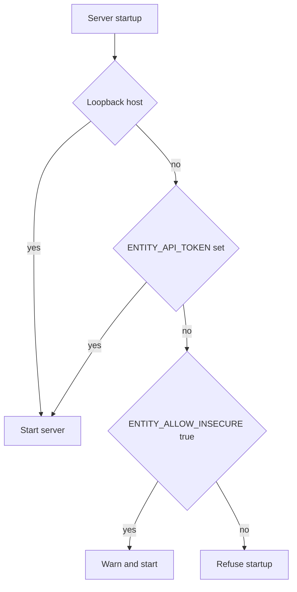
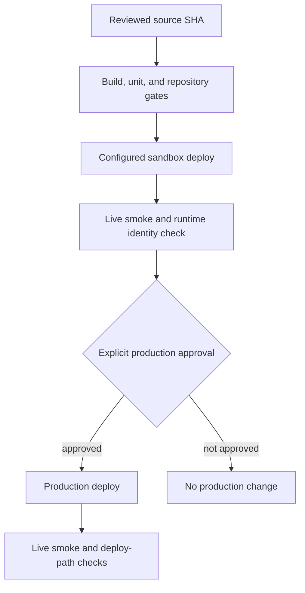

# Security, testing, and release flow

Entity's default posture is local-first. Authentication, object authorization, evidence generation, and release promotion are separate controls; no single one implies the others have run.

## Network and authentication boundary

`packages/server/src/security.ts` applies security headers/CSP. It keeps generated Entity Wiki previews scriptless and opaque while still allowing blob-backed fragment scrolling for static previews, and it preserves the richer inline-script preview mode for interactive HTML exports. `packages/server/src/security.test.ts` covers the CSP split plus the HTTPS and localhost isolation-header behavior. `middleware/api-auth.ts` adds shared bearer-token protection when `ENTITY_API_TOKEN` is configured:

- `/api/health`, `/api/version`, ClickClack's self-authenticated prefix, tokenized onboarding resources, and enabled agent-native document routes have explicit exceptions;
- known legacy unprefixed task/activity/agent/runtime route roots are also protected;
- WebSocket upgrades accept the bearer header or a `?token=` query parameter;
- when no token is configured, global API authentication is skipped for local development.

The bind guard refuses non-loopback startup without a token unless `ENTITY_ALLOW_INSECURE=1` explicitly accepts the risk. CORS is globally permissive, so the bind/token boundary matters. Query-string WebSocket tokens can leak through URL logging; prefer headers where the client supports them.



*Entity fails closed for unauthenticated non-loopback binding unless an explicit insecure override is set.*

## Object authorization coverage

`permissions.ts` implements scope inheritance, roles (`viewer`, `contributor`, `manager`, `admin`), ACL allow/deny rules, sensitivity categories, actions, and redacted restricted envelopes. `request-permissions.ts` binds requests to an org and builds principal context from `x-entity-*` headers.

Admin access now also depends on stored principals: the admin auth middleware allows bootstrap when there are no principals yet, accepts a stored principal with an active admin grant, rejects disabled principals, and can fall back to localhost header compatibility for legacy/local setups when API auth is off. That means admin access is intentionally fail-closed once principals exist, but the repository still preserves a local migration path for old header-based behavior.

Two boundaries are crucial:

1. Principal/role/sensitivity headers are not cryptographically bound to claims in the shared bearer token. The token authenticates server access, not individual identity.
2. Object-level checks are route-specific. They are visibly used by document objects, search, and selected chat operations, but not uniformly by every task, plugin, Swarm, runtime, or operational route.

Do not describe Entity as having universal route-level RBAC. Restricted envelopes are designed to suppress titles, snippets, and content where integrated, as surfaced by [Files](../features/files-and-documents.md).

Powerful surfaces include terminal operations, runtime controls, provider callbacks, Swarm/eforge control, plugin management, and deployment. Keep allowlists and shared-token exposure in mind when changing them.

Local file-source protection is also path-realpath aware. The read-only overlap checks in `packages/server/src/fs/routes-sources.ts` and `packages/server/src/routes/legacy-files.ts` canonicalize candidate paths through the nearest existing ancestor, including write targets whose final leaf does not exist yet, before comparing them to protected local roots. That means a symlink alias cannot be used to downgrade a read-only local source or sneak a write path outside the intended source boundary.

## Testing and change gates

Common checks:

```bash
npm --prefix packages/app run build
npm --prefix packages/server run build
npm --prefix packages/server run test
npm run test:unit
npm run ctrl:gate
npm run test:live
npm run test:deploy
npm run test:e2e
```

Repository guidance requires colocated Vitest coverage for server changes and browser verification for user-facing work. `npm test` is the browser smoke harness, not the main unit-test command. Current `.ctrlrc.json` uses MVP gate mode and does not enforce coverage, so a green default gate is not proof of exhaustive behavior.

High-risk changes—provider/runtime contracts, authority and receipts, secret/private-default handling, command execution, live delivery, promotion/drift, and release proof—require adversarial review to closure. Deterministic Phase 2 proof scripts scan source and/or synthetic fixtures; they provide evidence but do not replace live integration and browser proof.

## Release and rollout truth



*Source capability moves through gates, sandbox validation, explicit approval, and production verification.*

`package.json` defines `deploy:sandbox`, `ship:sandbox`, `promote:prod`, release-info, and wiki verification commands. Current scripts:

- require explicit sandbox host/HTTP host/directory/database configuration;
- run `docs:wiki:verify` before sandbox and production deployment;
- use the fail-closed `deploy.sh` path;
- run live smoke after deployment;
- require `--yes` or `ENTITY_PROD_APPROVED=1` before production;
- require explicit production host/HTTP host/directory/database configuration and then run live plus deploy-path checks.

`deploy.sh` preserves and checks the explicitly configured database and excludes database files during code synchronization. Never infer or copy private deployment paths from operator-only material.

`docs/deploy-contract.md` describes a stronger target contract: promote the exact artifact/SHA validated in sandbox, prove identity with `/api/version`, `RELEASE.json`, and `VERSION`, capture rollback state, and keep production manual. That document also says the live system had not fully migrated to the target release layout at its audit date. Therefore, use current scripts and live release metadata—not the target diagram alone—to establish rollout.

## Operational truth checklist

When asked whether a feature “exists” or “is live”:

1. Use source and focused tests to establish implementation.
2. Check flags, plugin enablement, credentials, adapter/provider health, and degraded paths.
3. Use `/api/version` and release metadata to establish deployed identity.
4. Use sandbox/production validation and approval receipts to establish rollout.
5. Do not equate a route, type, TODO, plan, proof fixture, or UI placeholder with a working end-to-end capability.

This distinction applies especially to [execution providers and proof](../platform/execution-and-proof.md), [plugin mounts](../platform/configuration-and-plugins.md), and desktop/mobile packaging described in the [quickstart](../quickstart.md#desktop-and-mobile).
(../platform/execution-and-proof.md), [plugin mounts](../platform/configuration-and-plugins.md), and desktop/mobile packaging described in the [quickstart](../quickstart.md#desktop-and-mobile).
er/src/middleware/admin-auth.ts`.
