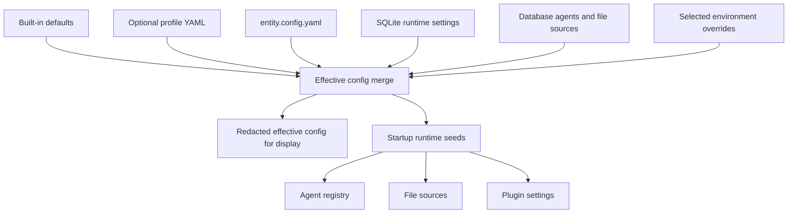
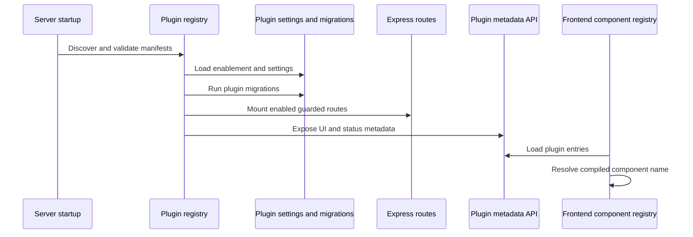

# Configuration, Admin, plugins, and services

Entity uses layered configuration: files establish portable defaults, SQLite holds runtime settings and registries, selected environment variables override deployment-sensitive behavior, and Admin exposes safe parts of those systems. Configuration should describe capability; [release evidence](../operations/security-and-release.md#release-and-rollout-truth) determines whether it is active in a deployment.

## Configuration precedence and seeding

*Layered input produces effective configuration and materializes selected records at startup.*

`packages/server/src/config/load.ts`, `effective.ts`, `runtime.ts`, and `schema.ts` implement this flow. Entity arrays with IDs are merged by ID; ordinary arrays are replaced. Bootstrap paths such as database/workspace configuration are restart-required rather than safely editable at runtime.

`entity.config.example.yaml` demonstrates local-safe server paths, agents, file sources, task columns/priorities/projects, empty public services, plugin defaults, voice, deploy behavior, and terminal targets. Keep secrets in environment/provider mechanisms, not this file. Effective-config responses redact recognized secret paths. Config-managed file sources keep their `entity.config.yaml` ownership marker through storage, reject API attempts to replace their adapter type with a different one, and remain non-deletable through the file-source API.

## Admin surfaces

`packages/app/src/views/AdminView.tsx` organizes General/session/PWA/theme, profile, Mission Control, integrations, TTS, plugins, agent registry, voice, Task Master, Docs, and an embedded OpenClaw/enterprise view. Users can inspect effective runtime configuration, manage file sources, configure document credentials, tune Task Master, manage plugins, and set TTS behavior.

The embedded OpenClaw view includes timeout, retry, and open-external degradation. Admin availability does not imply an integration endpoint is reachable.

## Model settings

There is no single general “Models Admin” domain. Keep these separate:

- chat/onboarding models from `/api/chat/models` and the chat picker;
- per-task execution model choices in Mission Control;
- the model resolved for an agent/runtime in the Agents surface;
- Task Master language-model provider/settings;
- the TTS provider/model under Admin.

Task Master supports Google and OpenAI-compatible configuration in `packages/server/src/agent/settings.ts`; without usable credentials, generated text degrades while non-generative task pickup can remain available. Never document or request credential values.

## Plugin lifecycle

A plugin manifest declares ID, version, kind, capabilities, hooks, routes, settings, storage/migrations, entrypoints, and an optional UI mount. Mount types are top-level tab, module subview, detail-panel section, Admin section, or none.

*Runtime plugin metadata is necessary but not sufficient for UI rendering: the component must also be compiled into the frontend registry.*

The frontend component registry currently resolves `EntityServicesBoard` and `SwarmBoard`. Unknown component names display unavailable/unregistered behavior; Entity does not dynamically download arbitrary plugin UI code. If a Mission Control plugin subview disappears or becomes disabled, the app resets to built-in Kanban after registry initialization.

Built-in server plugins include Entity Linker, Entity Services, and Geordi Swarm. The plugin registry supports DB-backed settings/enablement, migrations, hooks, runtime modules, route loading, and disabled-route guards. However, [Swarm](execution-and-proof.md) is also mounted as a core route before plugin mounts, so plugin disablement is not a reliable kill switch for the core `/api/swarm` surface.

## Entity Services

The active Services tab is supplied by the `entity-services` top-level plugin. It groups internal plugins, explicitly configured external HTTP services, and optional discovered listeners into service families; it models operational, degraded, offline, and unknown states with health/latency/links. The current registry flow can return a partial snapshot while full host discovery is still running, and the frontend summarizes that state as Discovery in progress, Discovery failed, or Discovery complete through `packages/app/src/components/entityServicesState.ts`. The service registry also validates SSH targets before it shells out for host discovery and prefers the live request host over stale tailnet service URLs when it can normalize a safer base URL.

Default public configuration contains no private services and disables gateway/Mac discovery. Availability depends on both server plugin registration and the compiled `EntityServicesBoard`. A separate simpler `ServicesPage` exists in source but is not registered in the current component registry and should not be claimed as the active surface.

## Important flags and degraded states

| Setting | Default/source behavior |
|---|---|
| `ENTITY_FS_MULTISOURCE` / `VITE_ENTITY_FS_MULTISOURCE` | Multi-source Files defaults true on server/client; align both sides |
| `ENTITY_AGENT_NATIVE_EDITOR` / `VITE_ENTITY_AGENT_NATIVE_EDITOR` | Native editor defaults true but still requires document/source identity and scoped auth |
| `ENTITY_FS_INDEXER_ENABLED` | File indexer defaults true |
| `ENTITY_AGENT_ENABLED` | Task Master scheduler defaults false |
| `ENTITY_CHAT_CLICKCLACK_BRIDGE` | Optional compatibility routing to ClickClack |
| plugin `enabled` state | Guards normal plugin routes/UI metadata, subject to separately core-mounted routes |

See [Files and documents](../features/files-and-documents.md) and [Agents and collaboration](../features/agents-and-collaboration.md) for user-visible degradation.

## Change and test guidance

- Config changes: update schema, merge/effective behavior, redaction, example config, runtime seeding, and focused config tests together.
- Admin changes: establish whether a setting is persisted, environment-only, restart-required, or merely display state.
- Plugin changes: validate manifest, settings migration, route guard, hook lifecycle, frontend component registry, disable/restart behavior, and mount cleanup.
- Services changes: test discovery target validation, health timeout/cache/concurrency, family classification, and empty public defaults.

Run server Vitest, app build, and browser-check enabled, disabled, missing-component, unreachable-integration, and restart-required states.
