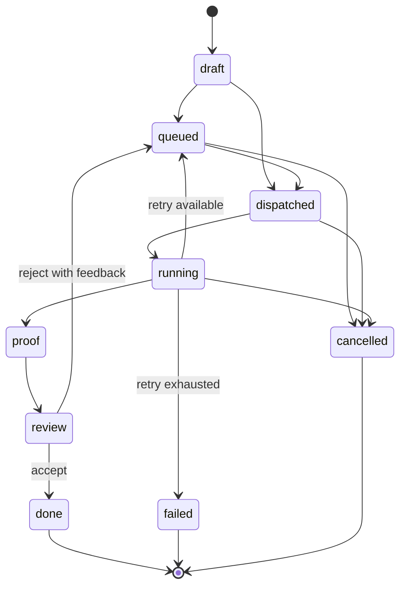
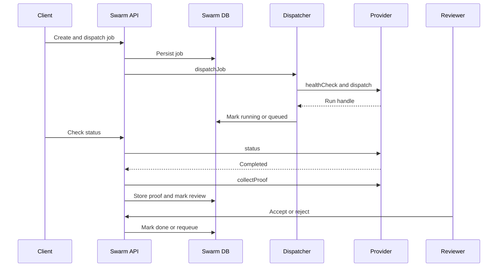
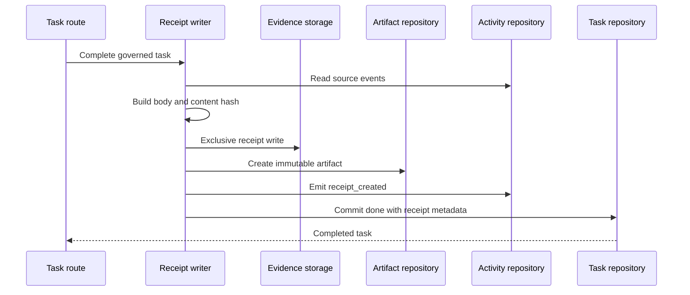

# Execution engines and proof

Entity has two different automation paths:

- **Task Master** scans and makes bounded changes to task state, optionally using a language model. It is part of [Mission Control](../features/mission-control.md).
- **Geordi Swarm** dispatches execution jobs to provider adapters and collects provider proof for review.

Neither should be conflated with the [agent registry](../features/agents-and-collaboration.md), which describes identities and runtime bindings rather than a single execution engine.

## Swarm lifecycle

*Swarm persists provider execution separately from task state and places collected proof into a review step.*

`/api/swarm/*` supports job creation, dispatch, status checks, cancellation, proof, review, provider health, and callbacks. The dispatcher health-checks the selected provider, marks the job dispatched, sends a provider-neutral payload, stores the run handle, and advances status on explicit checks/callbacks. There is no general background polling loop. A healer only detects long-running stale jobs and requeues or fails them.

Auto-dispatch exists but is off unless the `geordi-swarm` plugin setting `autoDispatch` is true; concurrency defaults to two when unspecified.

## Provider contract and status

Every `SwarmProvider` implements `healthCheck`, `dispatch`, `status`, `cancel`, and `collectProof` (`packages/server/src/swarm/providers/interface.ts`). The contract transports job identity/spec/repository/branch/context/feedback and can return commit, branch, logs, test result/output, screenshots, artifacts, and duration.

| Provider | Source-level status |
|---|---|
| ACP | HTTP push, status, cancellation, and basic proof implemented |
| Codex | WebSocket JSON-RPC dispatch/status/cancel implemented; proof is primarily streamed transcript |
| Symphony | Pull/tracker adapter implemented; executor writes status/proof back |
| eforge | Queue-file dispatch implemented; API health exists, API push is explicitly not implemented |
| CCP | Registered placeholder; dispatch unavailable |
| Flywheel | Registered placeholder; dispatch unavailable |

Provider implementations are currently imported and registered directly in `swarm/dispatcher.ts`, despite comments in `provider-registry.ts` describing hook-based registration. Treat executable dispatcher code as authoritative.

*Status advances through explicit API interactions or callbacks, not continuous universal polling.*

Important boundaries:

- Proof collection failure still advances a completed run to `review`, so reviewers must inspect proof completeness.
- Provider callbacks share the server authentication boundary; they are powerful mutation paths.
- Swarm is core-mounted at `/api/swarm` before plugin route mounting and also has a plugin manifest. Disabling the plugin may hide UI/plugin state without disabling the core API. See [Configuration and plugins](configuration-and-plugins.md#plugin-lifecycle).

## Swarm proof versus canonical receipt

A **Swarm proof** belongs to a Swarm job and captures provider execution evidence. A **canonical task receipt** belongs to a completed task and records governed task completion. They are separate tables, flows, and review meanings.

### Canonical task completion receipts

When receipt enforcement is enabled (default in phase flags), `completeTaskWithReceipt`:

1. reads source activity;
2. builds canonical Markdown and its SHA-256 content hash;
3. exclusively writes the receipt body;
4. creates an immutable `raw_task_receipt` evidence artifact;
5. emits `receipt_created` activity; and
6. commits the task transition to `done` with receipt metadata.

*Immutable evidence is written before the final task state transition.*

Body-write failure blocks completion and records `receipt_status=failed`. A later metadata/artifact failure records `integrity_error` and reconciliation metadata; metadata can be regenerated from an existing receipt body. Do not expose raw receipt contents from private deployments in documentation.

## Change and test guidance

Provider-contract, dispatch, callback, receipt, authority, and dangerous-action changes are high risk. Inspect `packages/server/src/swarm/`, `receipt-writer.ts`, `phase2-flags.ts`, task completion routes, plugin mount order, and their colocated tests. Run server build/Vitest and the repository's adversarial review gates. Deterministic proof scripts are useful release evidence but are not substitutes for a live end-to-end/browser verification; see [Security and release](../operations/security-and-release.md).
