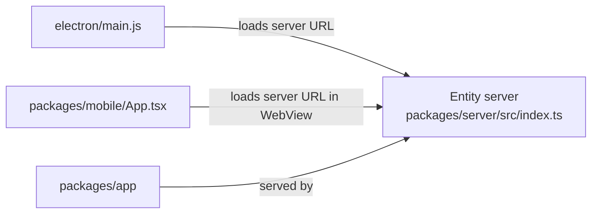

# Desktop and mobile shells

Entity ships two optional shells around the same server-backed workspace: an Electron desktop app and an Expo mobile app. Neither shell reimplements core product logic; both connect to the running Entity server and present the same workspace with platform-specific entry behavior.

## Desktop shell

`electron/main.js` creates an Electron window that points at `ENTITY_URL` or `DEV_URL`, probes the server, and starts `npm run dev` locally if the repository checkout is present and the server is not already running. It also configures a local SQLite path under the user's app data directory and keeps the renderer sandboxed.

The desktop package configuration in `electron/package.json` shows the packaging targets and that the app is intended for DMG and NSIS builds.

## Mobile shell

`packages/mobile/App.tsx` is a WebView shell around the same server. It starts with a connect/check screen, accepts a server URL, and then loads the workspace in a `react-native-webview`. The README explains that on a real phone you generally need the computer's LAN IP rather than `localhost`.

## How the shells relate to the core app

Caption: both shells are wrappers around the same server-backed web app.

## Degraded states and operator notes

- The desktop shell can show a connecting page while it waits for the server or spawns one locally.
- The mobile shell can show a connection error screen until the user points it at a reachable server.
- The mobile README notes that LAN use requires the server to listen on a non-loopback address and may require API authentication or an explicit insecure-allow flag.

## Evidence to check before changing behavior

- `electron/main.js` for load, spawn, and security behavior.
- `packages/mobile/App.tsx` and `packages/mobile/README.md` for the mobile connection model.
- `packages/app/src/App.tsx` for the actual workspace the shells are loading.
