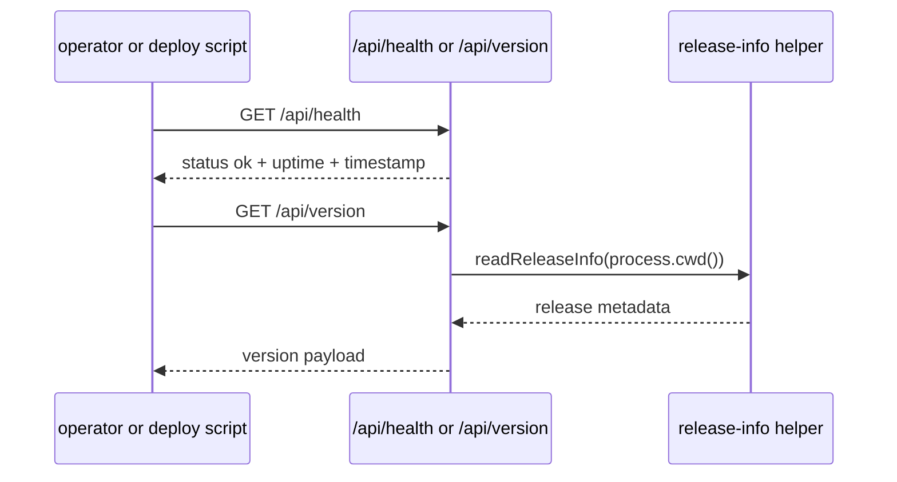

# Runtime and release

Entity keeps a set of lightweight public probes and release helpers so operators can verify the live runtime without opening a privileged session. The same page also owns the hardened OpenWiki integration, because the docs pipeline now behaves like release tooling rather than a loose side script.

The main source seams are:

- `packages/server/src/routes/core.ts` for health, version, and phase-2 diagnostic probes.
- `packages/server/src/config/runtime.ts`, `packages/server/src/config/schema.ts`, and `packages/server/src/config/runtime.test.ts` for bootstrap config, local-source allowlisting, and config-derived runtime env.
- `scripts/entity-release-info.mjs` for release metadata.
- `scripts/entity-verify-sandbox.sh`, `scripts/entity-deploy-sandbox.sh`, and `scripts/entity-promote-prod.sh` for deployment checks and promotion flow.
- `scripts/entity-openwiki.mjs` and `scripts/entity-openwiki-lib.mjs` for local OpenWiki generation, isolated credential handling, fingerprinting, and verification.
- `package.json` for the command surface that ties those checks together.

## What operators can verify

- Whether the server is alive at `/api/health`.
- Which release identity is currently running at `/api/version`.
- Phase-2 diagnostic state when that feature set is enabled.
- Whether a sandbox deployment matches expected release information before promotion.
- Whether a production promotion step should proceed.
- Whether committed OpenWiki content matches the current source fingerprint before sandbox or production shipping continues.

## Probe flow

`packages/server/src/routes/core.ts` exposes the public probes used by the README and deployment scripts. The health route returns a simple `status: ok` payload, while the version route returns release information read from the repo’s release metadata helper.

The OpenWiki toolchain now treats docs freshness as a release boundary. `scripts/entity-openwiki-lib.mjs` computes the source fingerprint that is written to `openwiki/.entity-openwiki.json`; the fingerprint includes the repo roots that are meant to ship, ignores private env files and ignored directories, and now explicitly counts tracked source nested under `build` and `dist` path segments. That nested-source coverage was finalized in `scripts/entity-openwiki-lib.test.mjs`, which exercises `packages/server/src/build/manifest.ts` and `packages/app/src/dist/fixture.ts` so shipped source in those paths still changes the fingerprint.

## Release and deploy commands

The root package scripts expose the canonical automation entrypoints:

- `npm run verify:sandbox`
- `npm run deploy:sandbox`
- `npm run ship:sandbox`
- `npm run promote:prod`
- `npm run release:info`
- `npm run release:check`
- `npm run docs:wiki:init`
- `npm run docs:wiki:update`
- `npm run docs:wiki:prepare`
- `npm run docs:wiki:verify`

The release and deploy scripts are source evidence for a real release process, but they do not by themselves prove production rollout. For rollout status, the repo treats release metadata and deployment receipts as authoritative. The OpenWiki scripts follow the same pattern: `init` and `update` generate documentation, `prepare` first checks that generated docs are clean, then skips generation when the wiki fingerprint is already fresh, and only regenerates when the fingerprint is stale; it exits 75 when generated files need review and commit. `verify` checks the generated wiki against the current source fingerprint. That fingerprint now includes `package.json`, `README.md`, `AGENTS.md`, `CLAUDE.md`, `CONTEXT.md`, `.openwikiignore`, `.github/workflows`, `.cursor/loops/README.md`, `openwiki/INSTRUCTIONS.md`, `entity.config.example.yaml`, `deploy.sh`, `docs`, `packages`, `electron`, `scripts`, and `tools/openwiki`, so docs freshness now covers the repo’s workflow, public-doc, root-context, and focused-test surfaces. `scripts/entity-openwiki-lib.mjs` computes that fingerprint from tracked and non-ignored untracked files when git metadata is available, while still falling back to symlink-safe recursive collection if necessary; the tracked-source fingerprint test now explicitly exercises tracked files nested under `build` and `dist` directory names so shipped source under those paths still counts. It also preserves `OPENWIKI_PROVIDER_RETRY_ATTEMPTS` for provider runs and filters proxy variables so only credential-free `HTTP_PROXY` or `HTTPS_PROXY` values are forwarded, while `NO_PROXY` always passes through. `scripts/entity-openwiki.mjs` now runs OpenWiki in an isolated temporary home with a private `.npmrc`, so credential files do not leak into the runner profile, and it only passes through provider credentials for the selected provider. The launcher validates the requested provider against the supported provider set before execution, and `openai-chatgpt` is credentialless at the provider-list level; if local Codex OAuth tokens are available, they are translated into the `OPENAI_CHATGPT_*` environment variables before the run starts. If either `pnpm install` or the OpenWiki process fails, the launcher still removes that isolated HOME in a `finally` block. `package.json` wires `ship:sandbox` to `docs:wiki:prepare` before `ctrl:gate` and `deploy:sandbox`, so a clean rerun confirms the review has been handled before deployment continues. `scripts/entity-deploy-sandbox.sh` and `scripts/entity-promote-prod.sh` both require `docs:wiki:verify` before deployment, and `deploy.sh` verifies the exact source checkout, checks the release safety script, syncs `openwiki/` into every configured runtime target, and writes release/runtime metadata to the remote target only after the docs gate passes. The GitHub workflows are freshness guards rather than generators: `/.github/workflows/loop-docs-sweep.yml` audits the integration, with the weekly docs guard gated by `ENTITY_LOOPS_ENABLED=true` while manual `workflow_dispatch` remains available, and `/.github/workflows/main.yml` now separates merge-tree tests from generated-doc freshness verification by checking out the pull request head before running `npm run docs:wiki:verify` on pull requests, including fork-aware head checkouts so the docs gate validates the exact PR tip rather than the merge commit. The helper script now also keeps the bootstrap files aligned with that policy so the same rule is stated in `AGENTS.md` and `CLAUDE.md`. `deploy.sh` now also handles cross-platform remote Node discovery: when `ENTITY_REMOTE_NODE_BIN` is unset it SSHes to the target and probes `/opt/homebrew/opt/node@22/bin/node`, `/opt/homebrew/bin/node`, `/usr/local/bin/node`, and `/usr/bin/node` before falling back to `command -v node`, so release metadata writes can run on both Homebrew-style and standard Linux/Unix layouts. For detached gateway checkouts, it now requires `ENTITY_RELEASE_BRANCH`, validates the branch name, resolves the exact tip from `refs/remotes/origin/<branch>` before falling back to `refs/heads/<branch>`, and refuses to proceed unless that exact branch tip matches the checkout SHA. `scripts/entity-release-check.sh` still prints the current branch and short SHA, and `deploy.sh` uses that clean-worktree guard before syncing. `openwiki/.entity-openwiki.json` captures the refreshed fingerprint produced by the latest generation run. `deploy.sh` also serializes the release identity payload as JSON on stdin and then executes `scripts/entity-release-info.mjs` on the remote host without shell-interpolating the metadata arguments, so the branch, SHA, environment, and script path are preserved exactly when remote metadata is written. The webhook deployer now mirrors that identity contract: `scripts/entity-deploy-webhook-server.mjs` fetches `origin/main` durably before checkout and passes exact `ENTITY_RELEASE_SHA` and `ENTITY_RELEASE_BRANCH=main` into `deploy.sh`, while `scripts/entity-gateway-pull-deploy.mjs` records and deploys the configured branch from `refs/remotes/origin/<branch>` and forwards the same branch in the release environment.

`deploy.sh` now hardens the delivery path further: it refuses to use public defaults for the production target or database, supports `--print-config` plus `ENTITY_DEPLOY_DRY_RUN=1` for a dry configuration check, requires the executable release-check script, verifies the exact checkout identity before sync, checks the production database task count before sync, backs up the database before copying, syncs generated OpenWiki docs separately, excludes SQLite and WAL files from rsync, restores the server DB symlink if needed, and can skip restart/verification only when `ENTITY_DEPLOY_SKIP_RESTART=1` is set. It also writes release/runtime metadata remotely through `scripts/entity-release-info.mjs` only after the docs gate passes. `scripts/entity-release-check.sh` now prints the current branch and short SHA in its success and failure output, which is useful when a deploy is blocked by a dirty worktree.

`deploy.sh` also handles cross-platform remote Node discovery: when `ENTITY_REMOTE_NODE_BIN` is unset it SSHes to the target and probes `/opt/homebrew/opt/node@22/bin/node`, `/opt/homebrew/bin/node`, `/usr/local/bin/node`, and `/usr/bin/node` before falling back to `command -v node`, so release metadata writes can run on both Homebrew-style and standard Linux/Unix layouts. For detached gateway checkouts, it now requires `ENTITY_RELEASE_BRANCH`, validates the branch name, resolves the exact tip from `refs/remotes/origin/<branch>` before falling back to `refs/heads/<branch>`, and refuses to proceed unless that exact branch tip matches the checkout SHA. `deploy.sh` also serializes the release identity payload as JSON on stdin and then executes `scripts/entity-release-info.mjs` on the remote host without shell-interpolating the metadata arguments, so the branch, SHA, environment, and script path are preserved exactly when remote metadata is written. The validated remote Node binary that `deploy.sh` resolves is reused for both that remote metadata generation and the fallback service restart path, keeping the same executable in play across release-info writes and restart handling.

Runtime bootstrap now also seeds `ENTITY_FS_LOCAL_SOURCE_ROOTS` from configured local file sources, so trusted local roots declared in config are part of the allowlist before file-source handling begins. The example config marks `entity-wiki` as `readOnly: true`, which aligns the seeded source record with the adapter's read-only capabilities. If you change OpenWiki generation or release plumbing, keep `scripts/entity-openwiki-lib.mjs`, `scripts/entity-openwiki.mjs`, `scripts/entity-release-check.sh`, `deploy.sh`, and `.github/workflows/main.yml` aligned so the exact checkout, provider validation, isolated-home behavior, and remote metadata write path stay consistent.

## Change notes for future agents

When changing runtime or release behavior, inspect both the server probes and the shell scripts that consume them. If you touch the release identity format, keep the API route and the verification script in sync. For OpenWiki changes, update the integration page here first; it is the canonical home for the generation, prepare, and verify flow. If the prepare path changes again, keep `scripts/entity-openwiki-lib.mjs`, `scripts/entity-openwiki.mjs`, and `scripts/entity-release-check.sh` aligned with the docs so sandbox shipping, freshness verification, and release safety stay convergent.
