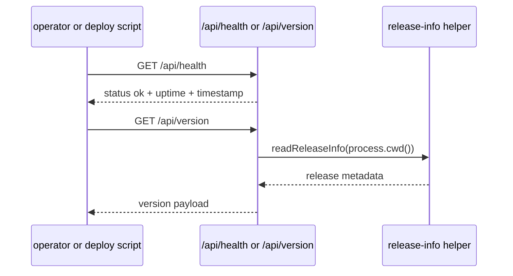

# Runtime and release

Entity keeps a set of lightweight public probes and release helpers so operators can verify the live runtime without opening a privileged session. The same page also owns the hardened OpenWiki integration, because the docs pipeline now behaves like release tooling rather than a loose side script.

The main source seams are:

- `packages/server/src/routes/core.ts` for health, version, and phase-2 diagnostic probes.
- `packages/server/src/config/runtime.ts`, `packages/server/src/config/schema.ts`, and `packages/server/src/config/runtime.test.ts` for bootstrap config, local-source allowlisting, and config-derived runtime env.
- `scripts/entity-release-info.mjs` and `scripts/entity-release-info-stdin.mjs` for release metadata. `scripts/entity-release-info-stdin.mjs` validates JSON stdin payloads before delegating to `scripts/entity-release-info.mjs`, which keeps remote metadata writes shell-safe.
- `scripts/entity-verify-sandbox.sh`, `scripts/entity-deploy-sandbox.sh`, and `scripts/entity-promote-prod.sh` for deployment checks and promotion flow. The sandbox and deployment scripts now enforce exact release identity through the checked-out branch and SHA, and the GitHub workflow verifies generated docs against the pull-request head rather than the merge commit.
- `scripts/entity-openwiki.mjs`, `scripts/entity-openwiki-lib.mjs`, `scripts/entity-openwiki-html.mjs`, and `packages/app/scripts/entity-openwiki-html-lib.mjs` for local OpenWiki generation, HTML presentation rendering, isolated credential handling, fingerprinting, and verification. `scripts/entity-wiki-config-migrate.mjs` updates older configs so the `entity-wiki` source points at `./openwiki-html` instead of the generated wiki input tree, and `packages/server/src/fs/classify.ts` plus `packages/server/src/fs/index-runner.ts` strip HTML tags and entities before indexing the generated presentation pages. `scripts/entity-runtime-env.mjs` serializes the runtime environment allowlist that deployment scripts write to disk, with `RUNTIME_ENV_KEYS` defining the exact set of runtime variables that are preserved when `ENTITY_BASE_URL` is canonicalized and `serializeRuntimeEnv` rejecting non-canonical origins instead of passing them through. `package.json` now wires `npm run build` to compile the app, db, and server packages and then run `node scripts/build-managed-storage-broker.mjs`, so the native managed-storage broker is built and installed in clean checkouts as part of the normal root build. That build script now verifies the `fs_guard` helper before every execution, compiles the C broker, runs its direct C tests, installs the executable into both the source and runtime build roots, and fails closed on unsafe bases, symlinked output paths, or non-regular source/output files. `packages/server/native/managed-storage-broker/fs_guard.c` is the newer kernel-conditional helper used by that transaction: it anchors mutations to verified parent directories and performs guarded exchange, link-absent, remove-owned, and selftest operations so publication and rollback stay fail-closed even under parent-directory swaps or unexpected final-path replacements. `scripts/entity-build-broker-transaction.test.mjs` exercises that contract with final-path symlinks, injected swaps, absent finals, rollback restore/remove cases, and parent-directory replacement. `scripts/entity-build-broker-wiring.test.mjs` locks in the surrounding wiring by proving the broker build runs after the server build, honors `CC`, preserves published outputs when compilation fails, rejects a symlinked output root, and leaves executable broker binaries in both expected locations. The release-manifest tests continue to lock in the identity contract: `package-lock.json` is hashed by link text instead of resolved bytes, `artifactHash` ignores mutable runtime files such as `.env`, SQLite WAL/DB state, and log files, `distHashes` are computed per shipped dist root, and retargeting a symlink changes the relevant hash while mutating bytes behind the same link does not. The recent managed-storage broker hardening now also has a focused source-side guard: `packages/server/native/managed-storage-broker/managed_storage_broker.c` rejects absolute paths, `.`/`..` segments, symlinks, and oversized I/O, uses `O_NOFOLLOW` for reads and writes, and serializes replace operations under a root lock so the deployed runtime does not depend on outside filesystem writers behaving well.
- `scripts/entity-readiness-poll.sh` for bounded post-restart readiness checks against `/api/tasks`, which require a numeric task count at least as high as the preflight DB count before deploy can continue.
- `packages/server/native/managed-storage-broker/managed_storage_broker.c` for server-side storage path validation, symlink rejection, bounded IO, and locked replace operations.
- `packages/app/src/lib/htmlPreviewPolicy.ts` now makes the `entity-wiki` HTML preview use a static sandbox with no script execution, while interactive HTML sources keep the richer preview sandbox; `packages/app/src/components/CodeMirrorFileViewer.tsx`, `packages/app/src/views/DocumentEditorView.tsx`, and `packages/app/src/views/MobileView.tsx` consume that policy so the viewer and mobile shell preserve safe fragment navigation for generated wiki pages without widening the preview surface. `CodeMirrorFileViewer` now rebuilds the static preview object URL when the route hash changes and reloads that same iframe node once after a deep-linked page loads, so browser scroll restoration cannot override the requested fragment while the preview stays scriptless and React retains ownership of the DOM node. The release-side file-reading work also tightened the shared bounded-read helper used by local, HTTP markdown, and docsify adapters, which keeps the 16 MiB source-read ceiling aligned with the Files page and ensures oversized source reads fail consistently at the server boundary. This page is also the canonical home for the OpenWiki render and release flow, including `scripts/entity-openwiki-html.mjs`, `packages/app/scripts/entity-openwiki-html-lib.mjs`, `scripts/entity-wiki-config-migrate.mjs`, `scripts/entity-release-info-stdin.mjs`, and the release-manifest identity contract that records branch, git SHA, artifact hashes, and dist hashes for shipped build outputs. `package.json` wires the commands that tie those checks together.

## What operators can verify

- Whether the server is alive at `/api/health`.
- Which release identity is currently running at `/api/version`.
- Phase-2 diagnostic state when that feature set is enabled.
- Whether a sandbox deployment matches expected release information before promotion.
- Whether a production promotion step should proceed.
- Whether committed OpenWiki content matches the current source fingerprint before sandbox or production shipping continues.

## Probe flow

`packages/server/src/routes/core.ts` exposes the public probes used by the README and deployment scripts. The health route returns a simple `status: ok` payload, while the version route returns release information read from the repo’s release metadata helper.

The OpenWiki toolchain now treats docs freshness as a release boundary. `scripts/entity-openwiki-lib.mjs` computes the source fingerprint that is written to `openwiki/.entity-openwiki.json`; the fingerprint includes the repo roots that are meant to ship, ignores private env files and ignored directories, and now explicitly counts tracked source nested under `build` and `dist` path segments. That nested-source coverage was finalized in `scripts/entity-openwiki-lib.test.mjs`, which exercises `packages/server/src/build/manifest.ts` and `packages/app/src/dist/fixture.ts` so shipped source in those paths still changes the fingerprint.

## Release and deploy commands

The root package scripts expose the canonical automation entrypoints:

- `npm run verify:sandbox`
- `npm run deploy:sandbox`
- `npm run ship:sandbox`
- `npm run promote:prod`
- `npm run release:info`
- `npm run release:check`
- `npm run docs:wiki:init`
- `npm run docs:wiki:update`
- `npm run docs:wiki:prepare`
- `npm run docs:wiki:verify`

The release and deploy scripts are source evidence for a real release process, but they do not by themselves prove production rollout. For rollout status, the repo treats release metadata and deployment receipts as authoritative. The OpenWiki scripts follow the same pattern: `init` and `update` generate documentation, `prepare` first checks that generated docs are clean, then skips generation when the wiki fingerprint is already fresh, and only regenerates when the fingerprint is stale; it exits 75 when generated files need review and commit. `verify` checks the generated wiki against the current source fingerprint. That fingerprint now includes `package.json`, `README.md`, `AGENTS.md`, `CLAUDE.md`, `CONTEXT.md`, `.openwikiignore`, `.github/workflows`, `.cursor/loops/README.md`, `openwiki/INSTRUCTIONS.md`, `entity.config.example.yaml`, `deploy.sh`, `docs`, `packages`, `electron`, `scripts`, and `tools/openwiki`, so docs freshness now covers the repo’s workflow, public-doc, root-context, and focused-test surfaces. `scripts/entity-openwiki-lib.mjs` computes that fingerprint from tracked and non-ignored untracked files when git metadata is available, while still falling back to symlink-safe recursive collection if necessary; the tracked-source fingerprint test now explicitly exercises tracked files nested under `build` and `dist` directory names so shipped source under those paths still counts. It also preserves `OPENWIKI_PROVIDER_RETRY_ATTEMPTS` for provider runs and filters proxy variables so only credential-free `HTTP_PROXY` or `HTTPS_PROXY` values are forwarded, while `NO_PROXY` always passes through. `scripts/entity-openwiki.mjs` now runs OpenWiki in an isolated temporary home with a private `.npmrc`, so credential files do not leak into the runner profile, and it only passes through provider credentials for the selected provider. The launcher validates the requested provider against the supported provider set before execution, and `openai-chatgpt` is credentialless at the provider-list level; if local Codex OAuth tokens are available, they are translated into the `OPENAI_CHATGPT_*` environment variables before the run starts. If either `pnpm install` or the OpenWiki process fails, the launcher still removes that isolated HOME in a `finally` block. `package.json` wires `ship:sandbox` to `docs:wiki:prepare` before `ctrl:gate` and `deploy:sandbox`, so a clean rerun confirms the review has been handled before deployment continues. `scripts/entity-deploy-sandbox.sh` and `scripts/entity-promote-prod.sh` both require `docs:wiki:verify` before deployment, and `deploy.sh` verifies the exact source checkout, checks the release safety script, syncs `openwiki/` into every configured runtime target, and writes release/runtime metadata to the remote target only after the docs gate passes. The GitHub workflows are freshness guards rather than generators: `/.github/workflows/loop-docs-sweep.yml` audits the integration, with the weekly docs guard gated by `ENTITY_LOOPS_ENABLED=true` while manual `workflow_dispatch` remains available, and `/.github/workflows/main.yml` now separates merge-tree tests from generated-doc freshness verification by checking out the pull request head before running `npm run docs:wiki:verify` on pull requests, including fork-aware head checkouts so the docs gate validates the exact PR tip rather than the merge commit. The helper script now also keeps the bootstrap files aligned with that policy via `normalizeOpenWikiBootstrapText` in `scripts/entity-openwiki-lib.mjs`, which rewrites the scheduled-refresh wording in `AGENTS.md` and `CLAUDE.md` to state the Entity-specific pre-ship/refresher contract, so the same rule is stated consistently in both files. `deploy.sh` now also handles cross-platform remote Node discovery: when `ENTITY_REMOTE_NODE_BIN` is unset it SSHes to the target and probes `/opt/homebrew/opt/node@22/bin/node`, `/opt/homebrew/bin/node`, `/usr/local/bin/node`, and `/usr/bin/node` before falling back to `command -v node`, so release metadata writes can run on both Homebrew-style and standard Linux/Unix layouts. For detached gateway checkouts, it now requires `ENTITY_RELEASE_BRANCH`, validates the branch name, resolves the exact tip from `refs/remotes/origin/<branch>` before falling back to `refs/heads/<branch>`, and refuses to proceed unless that exact branch tip matches the checkout SHA. `scripts/entity-release-check.sh` still prints the current branch and short SHA, and `deploy.sh` uses that clean-worktree guard before syncing. `openwiki/.entity-openwiki.json` captures the refreshed fingerprint produced by the latest generation run. `deploy.sh` also serializes the release identity payload as JSON on stdin and sends it to the remote `scripts/entity-release-info-stdin.mjs` wrapper, which validates the payload and invokes `scripts/entity-release-info.mjs` with explicit arguments. That keeps executable code in a file, preserves the branch, SHA, environment, and script path exactly, and avoids shell interpolation of metadata arguments when remote release info is written. The new `scripts/entity-openwiki-html.mjs` wrapper and `packages/app/scripts/entity-openwiki-html-lib.mjs` render the generated wiki into `openwiki-html/`, rewrite internal links for docs hosting, exclude `INSTRUCTIONS.md` and `log.md`, and record a content hash in `openwiki-html/.entity-openwiki-html.json`. `scripts/entity-openwiki.mjs` treats HTML presentation freshness as part of `prepare`, so a fresh run still verifies the rendered HTML before skipping generation. `package.json` exposes that flow through `docs:wiki:render` and `test:wiki-html`, and the wrapper can also be run in `verify` mode for the presentation tree. `scripts/entity-wiki-config-migrate.mjs` updates the `entity-wiki` source in `entity.config.example.yaml` from `basePath: ./openwiki` to `basePath: ./openwiki-html` when the config still points at the generated wiki input, with a backup written before the in-place migration. The HTML presentation tree is also part of the file-index story: `packages/server/src/fs/classify.ts` strips HTML tags and entities before deriving titles and content for index entries, and `packages/server/src/fs/index-runner.ts` uses that extraction when indexing source files. The release-manifest identity contract now has a focused test suite: `scripts/entity-release-info.test.mjs` proves that symlink target changes matter only when the repository link target changes, that nested shipped `VERSION` files contribute to `artifactHash`, and that `deploy.sh` preflights the exact remote Node binary before synchronization. The release manifest writer, `scripts/entity-release-info.mjs`, now captures `repo`, `branch`, `gitSha`, `environmentBuiltFor`, `packageLockHash`, `artifactHash`, and `distHashes` for `packages/app/dist`, `packages/server/dist`, and `packages/db/dist`, plus `githubRunId`/`githubRunUrl` tied to `GITHUB_RUN_ID` and the `repo` value. The `--repo` argument overrides the manifest `repo` field (default `h-mascot/entity`) and the derived `githubRunUrl`. Its `--check` mode compares `RELEASE.json` and `VERSION`, and `--write` persists both files in the target release tree. The latest OpenWiki audit evidence is metadata-only: `docs/plans/evidence/entity-document-integrations/T-001/AUDIT.md` captures a final `browser-proof/quickstart.png` receipt and says the committed `openwiki/*.md` pages were unchanged while `openwiki/.entity-openwiki.json` was refreshed. The new `scripts/entity-readiness-poll.sh` helper is the bounded post-restart readiness check used by deploys: it polls `/api/tasks`, requires a numeric count that is at least the preflight DB count, and fails closed after a bounded attempt window instead of treating a transient zero or crash-loop as readiness. The native managed-storage broker hardening in `packages/server/native/managed-storage-broker/managed_storage_broker.c` closes the file boundary on the server side too: it rejects absolute paths, `.`/`..` path segments, symlinks, and oversized I/O, uses `O_NOFOLLOW` for reads and writes, and serializes replace operations under a root lock so the deployed runtime does not depend on outside filesystem writers behaving well.

## Change notes for future agents

When changing runtime or release behavior, inspect both the server probes and the shell scripts that consume them. If you touch the release identity format, keep the API route and the verification script in sync. For OpenWiki changes, update the integration page here first; it is the canonical home for the generation, prepare, and verify flow. If the prepare path changes again, keep `scripts/entity-openwiki-lib.mjs`, `scripts/entity-openwiki.mjs`, and `scripts/entity-release-check.sh` aligned with the docs so sandbox shipping, freshness verification, and release safety stay convergent.
