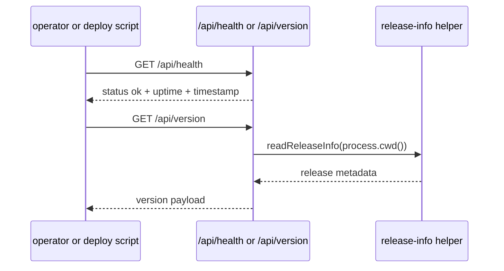

# Runtime and release

Entity keeps a set of lightweight public probes and release helpers so operators can verify the live runtime without opening a privileged session. The same page also owns the hardened OpenWiki integration, because the docs pipeline now behaves like release tooling rather than a loose side script.

The main source seams are:

- `packages/server/src/routes/core.ts` for health, version, and phase-2 diagnostic probes.
- `packages/server/src/config/runtime.ts`, `packages/server/src/config/schema.ts`, and `packages/server/src/config/runtime.test.ts` for bootstrap config, local-source allowlisting, and config-derived runtime env.
- `scripts/entity-release-info.mjs` for release metadata.
- `scripts/entity-verify-sandbox.sh`, `scripts/entity-deploy-sandbox.sh`, and `scripts/entity-promote-prod.sh` for deployment checks and promotion flow.
- `scripts/entity-openwiki.mjs` and `scripts/entity-openwiki-lib.mjs` for local OpenWiki generation, fingerprinting, and verification.
- `package.json` for the command surface that ties those checks together.

## What operators can verify

- Whether the server is alive at `/api/health`.
- Which release identity is currently running at `/api/version`.
- Phase-2 diagnostic state when that feature set is enabled.
- Whether a sandbox deployment matches expected release information before promotion.
- Whether a production promotion step should proceed.
- Whether committed OpenWiki content matches the current source fingerprint before sandbox or production shipping continues.

## Probe flow

`packages/server/src/routes/core.ts` exposes the public probes used by the README and deployment scripts. The health route returns a simple `status: ok` payload, while the version route returns release information read from the repo’s release metadata helper.

## Release and deploy commands

The root package scripts expose the canonical automation entrypoints:

- `npm run verify:sandbox`
- `npm run deploy:sandbox`
- `npm run ship:sandbox`
- `npm run promote:prod`
- `npm run release:info`
- `npm run release:check`
- `npm run docs:wiki:init`
- `npm run docs:wiki:update`
- `npm run docs:wiki:prepare`
- `npm run docs:wiki:verify`

The release and deploy scripts are source evidence for a real release process, but they do not by themselves prove production rollout. For rollout status, the repo treats release metadata and deployment receipts as authoritative. The OpenWiki scripts follow the same pattern: `init` and `update` generate documentation, `prepare` is the pre-ship path that regenerates docs and exits 75 when generated files need review and commit, and `verify` checks the generated wiki against the current source fingerprint. That fingerprint now includes `package.json`, `README.md`, `AGENTS.md`, `CLAUDE.md`, `CONTEXT.md`, `.openwikiignore`, `.github/workflows`, `.cursor/loops/README.md`, `openwiki/INSTRUCTIONS.md`, `entity.config.example.yaml`, `deploy.sh`, `docs`, `packages`, `electron`, `scripts`, and `tools/openwiki`, so docs freshness now covers the repo’s workflow, public-doc, root-context, and focused-test surfaces. `scripts/entity-openwiki.mjs` also normalizes `CLAUDE.md` so the repository instruction block states the current runner rule: Enterprise generates OpenWiki before sandbox shipping, and GitHub Actions verifies that committed generated docs remain fresh. `package.json` wires `ship:sandbox` to `docs:wiki:prepare` before `ctrl:gate` and `deploy:sandbox`, so a clean rerun confirms the review has been handled before deployment continues. `scripts/entity-deploy-sandbox.sh` and `scripts/entity-promote-prod.sh` both require `docs:wiki:verify` before deployment, and `deploy.sh` rsyncs `openwiki/` into every configured runtime target so deployments carry the committed wiki alongside the app. The GitHub workflows are freshness guards rather than generators: `/.github/workflows/loop-docs-sweep.yml` audits the integration, with the weekly docs guard gated by `ENTITY_LOOPS_ENABLED=true` while manual `workflow_dispatch` remains available, and `/.github/workflows/main.yml` runs `npm run docs:wiki:verify` as part of CI because no model credential is stored in GitHub. The helper script now also keeps the bootstrap files aligned with that policy so the same rule is stated in `AGENTS.md` and `CLAUDE.md`.

Runtime bootstrap now also seeds `ENTITY_FS_LOCAL_SOURCE_ROOTS` from configured local file sources, so trusted local roots declared in config are part of the allowlist before file-source handling begins. The example config marks `entity-wiki` as `readOnly: true`, which aligns the seeded source record with the adapter's read-only capabilities.

## Change notes for future agents

When changing runtime or release behavior, inspect both the server probes and the shell scripts that consume them. If you touch the release identity format, keep the API route and the verification script in sync. For OpenWiki changes, update the integration page here first; it is the canonical home for the generation, prepare, and verify flow.
